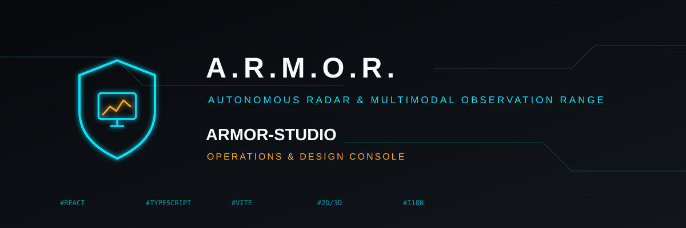
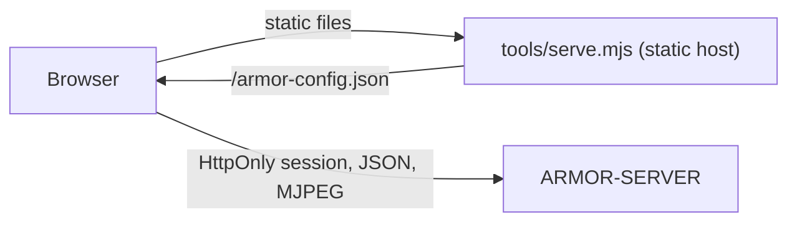

<p align="center">
  
</p>

# 🎛️ ARMOR-STUDIO

<p align="center">
  🇺🇸 <b>English</b> |
  <a href="README_spa.md">🇪🇸 Español</a> |
  <a href="README_fra.md">🇫🇷 Français</a> |
  <a href="README_ita.md">🇮🇹 Italiano</a> |
  <a href="README_deu.md">🇩🇪 Deutsch</a> |
  <a href="README_zho.md">🇨🇳 简体中文</a> |
  <a href="README_jpn.md">🇯🇵 日本語</a>
</p>

### Operations and design console: cameras, radar, alarms, solar energy, evidence and the site plan

<p align="center">
  
  
  
  
  
  
</p>

---

**Honesty check - what runs today:** Studio talks to [ARMOR-SERVER](https://github.com/JuanenRac/ARMOR-SERVER) and is covered by 307 unit tests (settings parsing, camera merging, the arithmetic of the solar charts, every menu rendered in the seven languages, the static host). What has **not** been proven is live video and PTZ against every real camera, the solar menus with a real inverter or battery, and a formal accessibility or usability review. While the server cannot be reached Studio shows demonstration data and says so in the top bar.

---

## 🎯 Overview

**ARMOR-STUDIO** is the operator's console. It never holds a camera password, an RTSP address or a token: it signs in to the server with a username and password, receives an 8-hour **HttpOnly** session, and everything privileged travels through that session.

* **Camera monitor:** 1, 2, 4, 6, 8, 9, 12 or 16 tiles that fit their frame (16:9, the whole matrix visible, no cropping), a maximized view with a bounded PTZ pad, snapshot and MP4 record; a **record library** to filter, preview, play, protect and delete evidence.
* **Alarms, devices and automations:** what needs a person right now with acknowledge and the closed record; smoke, gas, flood, door, window, motion, climate, plug, light, siren and lock devices over Wi-Fi, Zigbee, Bluetooth or a wire (presets for Zigbee2MQTT, Tasmota and Shelly); rules that switch devices when something happens; a big arm / disarm button.
* **Solar energy:** the *Inverters* menu draws the house as an animated energy flow (panels, grid, inverter, battery and load, with dashes that run faster for more power), gauges, readings, warnings in words and history charts; the *Batteries* menu shows each stack with a liquid level, its **capacities** (remaining and full, Ah and kWh, cycles, model), each module and **every cell** as a bar with its voltage and the spread in millivolts, and charts of charge, voltage, current, cell range and temperature.
* **Overview and system:** the state of the perimeter, one tile per part, a live map of the design with every device, and a system page with the audit trail for an administrator.
* **Radar:** a live map drawn from your site design (terrain, buildings, cameras, radars and their coverage) with the targets each radar reports, their recent path and the ignore zones; live node state, with silent nodes shown as *stale*; each node's own panel is one click away.
* **Site designer:** draw the terrain (rectangle or any shape, with typed lengths), place buildings of several floors with five kinds of roof, doors and windows at any floor and height, lamps, chimneys, solar panels, antennas, pillars, masts, roads and paths, then cameras and radars anywhere; a CAD-style 2D plan and a 3D view you can orbit, cut floor by floor and edit; undo and redo.
* **Configuration:** server address, cameras (ONVIF/RTSP), discovery, users (your account and, for an administrator, the list of users, roles and passwords), theme and language; a portable site export **without credentials**.
* **Weather and services:** the Services menu lists every program of the system and every field node, running or not, grouped by family; the Weather menu shows the weather of the place you choose (now, the rain of the next hour, warnings the forecast implies, 48 hours and 10 days, the air and pollen, the sun and the moon) with a live radar of rain and clouds.
* **The machine and the network:** *The machine, live* shows the CPU, memory, disks, temperature and network of the computer the server runs on; in the Network menu an operator can order a sweep, a ping, a traceroute, the ports or the web page of a device, and an administrator can keep the login of a device (stored encrypted on the server and never shown again) so that *Inspect* reads its model and firmware and warns about a factory login. Configuration -> General has a button that checks the server address and tells a wrong http/https from a server that is down.
* **Seven languages** (English, Spanish, German, French, Italian, Japanese, Chinese) and sixteen themes, the default one called *Armor*.
* **Declare your equipment:** in the Inverters and Batteries menus you add each inverter or battery stack with its name, model (Voltronic, MPP Solar, Pylontech US2000 / US3000 / US5000, ANT-BMS), connection (RS232, RS485, USB, CAN, Wi-Fi) and gateway node; it waits for its first real reading, and *Show example readings* lets you try the menu meanwhile.
* **Electrical Designer:** draw the house's electrical diagram (grid, meter, protections, transfer switches, distribution, PV, inverters, batteries and loads, AC and DC) with ports and wires, group it in panels, tie inverters and batteries to the solar devices the server reads to see their live values, and let the checks review it (two sources on one line, breakers and cables against the current, missing protections, DC voltages). The drawing is kept on the server; it is a drawing: nothing switches or measures anything yet.

## 🔄 Architecture



## 🔒 Security model

* **No secrets in the browser.** Camera passwords are entered once, sent to the server and shown afterwards only as a masked "stored" state. Site exports drop usernames and credential flags.
* **Stored settings are untrusted input.** They are parsed value by value: an invalid origin, theme, language or shape is dropped, positions are clamped and lists are capped.
* **No third-party requests, except the Weather menu, and only after you turn it on.** Fonts are local stacks; the static host sends `Content-Security-Policy: default-src 'self'` limited to the configured server and to the few weather services (Open-Meteo, RainViewer, EUMETSAT and Esri's map tiles), `frame-ancestors 'none'`, `nosniff` and `no-referrer`. The Weather menu asks nothing until you choose a place, and what leaves is that place's coordinates.
* Live video is shown only through a stream address the server issues to an operator.
* **Firmware of the nodes and notices:** *Configuration > Firmware* updates one node or every node of a type from a file or from the GitHub release, with a progress bar per node and the steps explained; *Notifications* connects the alarms to Telegram and Home Assistant and sends a test. Settings files, services and the broker of the system are edited there too, through the administration agent of the machine.

## 📂 Repository Structure

```text
ARMOR-STUDIO/
├── src/
│   ├── App.tsx, domain.ts, settings.ts, cameras.ts, hooks.ts, api.ts, config.ts, i18n.ts
│   ├── components/   camera, chrome, SiteMap
│   ├── views/        overview, monitoring, RadarView, RadarSensors, AlarmsView, DevicesView, AutomationsView, InvertersView, BatteriesView, SystemView
│   ├── designer/     geometry, ops, model, Plan2D, Viewport3D, Toolbox, Inspector
│   ├── electrical/   the Electrical Designer: model, ops, analysis (the checks), presets, symbols, sync
│   ├── solarModel.ts, solarGraphics.tsx, solarText.ts   the arithmetic, the drawings and the words of the solar menus
│   └── ...           ConfigurationPanel, UsersPanel, MediaLibrary, HistoryView, SiteDesignerInteractive, StudioLogin, one *Text.ts per area (7 languages)
├── tools/            serve.mjs (+ tests)
├── docs/             security model
└── images/           brand assets
```

## 🛠️ Development Environment

```powershell
npm install
npm run dev         # http://127.0.0.1:5178 against a server on 127.0.0.1:8080
npm run typecheck
npm test            # 307 tests: designer geometry, settings, cameras, radar map, solar arithmetic, the electrical designer, every menu in seven languages, static host
npm run build       # dist/
$env:ARMOR_SERVER_ORIGIN="http://192.168.0.180:18080"; node tools/serve.mjs   # serve the build
```

`tools/serve.mjs` reads `ARMOR_STUDIO_HOST` (default `127.0.0.1`), `ARMOR_STUDIO_PORT` (`5178`), `ARMOR_STUDIO_DIST` and `ARMOR_SERVER_ORIGIN`. To install the whole stack on the CM5 test bench see [ARMOR-DEVOPS](https://github.com/JuanenRac/ARMOR-DEVOPS).

## 🔗 Related Projects

**A.R.M.O.R.** (Autonomous Radar & Multimodal Observation Range) is a perimeter-security system made of independent repositories. Each one has its own version, its own tests and its own README; this is the family:

* **[ARMOR-COMMON](https://github.com/JuanenRac/ARMOR-COMMON)** - Message contracts, validators, conformance vectors and generated types
* **[ARMOR-RADAR](https://github.com/JuanenRac/ARMOR-RADAR)** - Field-node firmware for ESP32-S3 with three radars and its own web panel
* **[ARMOR-SOLAR](https://github.com/JuanenRac/ARMOR-SOLAR)** - Solar inverter and battery protocols and the messages of a gateway node
* **[ARMOR-ELECTRICAL](https://github.com/JuanenRac/ARMOR-ELECTRICAL)** - Electrical node: meters, the message of the network's readings and the rules for switching
* **[ARMOR-HMI](https://github.com/JuanenRac/ARMOR-HMI)** - Touch panel: the state of the system on a wall screen, arming and acknowledging, and the home of the voice assistant
* **[ARMOR-NETWORK](https://github.com/JuanenRac/ARMOR-NETWORK)** - The local network: its devices, the internet and what changes
* **[ARMOR-SERVER](https://github.com/JuanenRac/ARMOR-SERVER)** - Central coordinator: telemetry, alarms, devices, solar readings and cameras
* **ARMOR-STUDIO** (this repository) - Web console: cameras, radar, alarms, solar energy and the 2D/3D site designer
* **[ARMOR-ANDROID-CONTROL](https://github.com/JuanenRac/ARMOR-ANDROID-CONTROL)** - Android operator client with a live 2D/3D radar
* **[ARMOR-SERVER-AI](https://github.com/JuanenRac/ARMOR-SERVER-AI)** - Visual inference policy that explains its decisions and never actuates
* **[ARMOR-VOICE-AI](https://github.com/JuanenRac/ARMOR-VOICE-AI)** - Offline voice intents with a confirmation that cannot be forged
* **[ARMOR-HARDWARE](https://github.com/JuanenRac/ARMOR-HARDWARE)** - Enclosures, electronics and the bench acceptance matrix
* **[ARMOR-DEVOPS](https://github.com/JuanenRac/ARMOR-DEVOPS)** - Deployment, the CM5 test bench, backup and TLS
* **[ARMOR-SIMULATOR](https://github.com/JuanenRac/ARMOR-SIMULATOR)** - Offline telemetry simulator with repeatable faults
* **[ARMOR-UPDATER](https://github.com/JuanenRac/ARMOR-UPDATER)** - Detects, installs and updates the ecosystem's own repositories
* **[ARMOR-DOCS](https://github.com/JuanenRac/ARMOR-DOCS)** - Architecture, security baseline and the capability matrix

## 📚 Documentation & Community

Where to read more:

* [Capability matrix: what is proven and what is not](https://github.com/JuanenRac/ARMOR-DOCS/blob/main/docs/CAPABILITY_MATRIX.md)
* [Project catalogue: versions and how the repositories depend on each other](https://github.com/JuanenRac/ARMOR-DOCS/blob/main/docs/PROJECT_CATALOG.md)
* [Changelog of this repository](CHANGELOG.md)
* [License (GPL-3.0-or-later)](LICENSE)
* Questions, ideas and reports: electrohobby3d@gmail.com

## 👤 AUTHOR

**JuanenRac (Electro Hobby 3D)** · electrohobby3d@gmail.com

## 📜 LICENSE

GPL-3.0-or-later - see [LICENSE](LICENSE).
