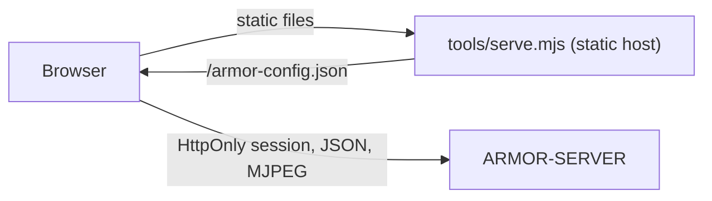

<p align="center">
  
</p>

# 🎛️ ARMOR-STUDIO

<p align="center">
  🇺🇸 <b>English</b> |
  <a href="README_spa.md">🇪🇸 Español</a> |
  <a href="README_fra.md">🇫🇷 Français</a> |
  <a href="README_ita.md">🇮🇹 Italiano</a> |
  <a href="README_deu.md">🇩🇪 Deutsch</a> |
  <a href="README_zho.md">🇨🇳 简体中文</a> |
  <a href="README_jpn.md">🇯🇵 日本語</a> |
  <a href="README_por.md">🇵🇹 Português</a>
</p>

### Operations and design console: cameras, radar, alarms, energy, the local network, evidence, the site plan and the upkeep of the installation

<p align="center">
  
  
  
  
  
  
  
</p>

---

**Honesty check - what runs today:** Studio talks to [ARMOR-SERVER](https://github.com/JuanenRac/ARMOR-SERVER) and is covered by 990 unit tests (settings parsing, camera merging, the arithmetic of the solar charts, the geometry and checks of the designers, the alarm announcer, the assistant's dictionary, every menu rendered in the eight languages, the static host) and by browser tests. It runs in daily use against the CM5 test bench with the real server, real IP cameras and a radar node on its board; the pictures of the Help are made with example data. What has **not** been proven is live video and PTZ against every possible camera, the solar, electrical, alarm-panel and touch-panel menus with real equipment (only the radar node exists) and a formal accessibility or usability review. While the server cannot be reached Studio shows demonstration data and says so in the top bar.

---

## 📋 At a glance

| | |
|---|---|
| Version | `0.8.1.0` |
| Maturity | Established |
| Tests | 990 (`npm test`) |
| Stack | React 19 / TypeScript / Vite |
| On real hardware | Used daily against the CM5 test bench (real server, real IP cameras, a real radar node); the solar, electrical, alarm-panel and touch-panel menus wait for real nodes |

## 🚦 Project status

Each line is one part of this repository and the light says how far it is today. It is written from what the repository can show (tests, builds, runs), not from what is planned.

🟢 Done and verified · 🟡 Works, with known limits · 🟠 Partly done or not verified yet · 🔴 Not done or not working

| Area | State | What it means here |
|---|---|---|
| Software | 🟢 | The console runs in daily use against the real server of the CM5 test bench. |
| Tests | 🟢 | 990 unit tests pass (`npm test`) and the browser tests run: settings, camera merging, the solar charts, the geometry and checks of the designers, the alarm announcer, the assistant's dictionary and every menu in the eight languages. |
| Interface | 🟡 | Live video and PTZ are not proven against every possible camera, there has been no formal accessibility or usability review, and the pictures of the Help are made with example data. |
| Hardware | 🟡 | It is used daily with the real server, real IP cameras and a real radar node; the solar, electrical, alarm-panel and touch-panel menus wait for real nodes. |
| Security | 🟡 | Sessions, roles and the refusal of camera logins in addresses are covered by tests; there has been no independent review. |
| Integration | 🟡 | While the server cannot be reached Studio shows demonstration data and says so in the top bar. |
| Documentation | 🟢 | Eight languages, the in-app Help and guided tours, the security notes and the changelog are up to date. |

## 🎯 Overview

**ARMOR-STUDIO** is the operator's console. It never holds a camera password, an RTSP address or a token: it signs in to the server with a username and password, receives an 8-hour **HttpOnly** session, and everything privileged travels through that session.

* **Overview and system:** the state of the perimeter, a tile for every part (alarm panels, radar, cameras, devices, energy, network, server), a live map of the design with every device and alarm, and what needs attention, all on one screen with no scrolling; a system page and an audit trail for an administrator.
* **Camera monitor:** 1, 2, 4, 6, 8, 9, 12 or 16 tiles that fit their frame (16:9, the whole matrix visible, no cropping), a maximized view with a bounded PTZ pad, snapshot and MP4 record; a **record library** to filter, preview, play, protect and delete evidence and to download a **proof of custody**.
* **Alarms:** what needs a person right now, with acknowledge and the closed record; a **check before arming** and a PIN to disarm; alarms drawn on the live map; a sound for every severity, a spoken voice with its own styles (plain, action hero, dark lord, theatrical) that also says when something connects, pop-ups, a mute button beside Help, and an optional jump to the right menu.
* **Devices and automations:** smoke, gas, flood, door, window, motion, climate, plug, light, siren, lock, shutter, gate, garage-door and water-heater devices over Wi-Fi, Zigbee, Bluetooth or a wire (presets for Zigbee2MQTT, Tasmota and Shelly); rules from any alarm source, with thresholds, that switch devices when something happens; a big arm / disarm button.
* **Alarm panels and the Alarm Designer:** the state of every ARMOR-NODE-ALARM node, its zones and events, the Zigbee sensors tied to the zones, and a designer where you draw the house's alarm (panels, contacts, motion, smoke, gas and flood detectors, sirens, keypads, wiring and radio links) and tie each drawn element to a real zone.
* **Solar and electrical energy:** the *Inverters* menu draws the house as an animated energy flow with gauges, readings and history charts; *Batteries* shows each stack with its capacities, each module and every cell; *Electrical* shows the grid input, each channel and the meters' alarms; in both you declare your equipment (Voltronic, MPP Solar, Pylontech, ANT-BMS…) and a *Show example readings* button lets you try the menu first.
* **Electrical Designer:** draw the house's electrical diagram (grid, meter, protections, transfer switches, distribution, PV, inverters, batteries and loads, AC and DC), tie it to the solar devices the server reads to see live values, and let the checks review it (two sources on one line, breakers and cables against the current…).
* **Radar:** a live map drawn from your site design with the targets each radar reports, their recent path and the **zones of the picture to ignore**; live node state, silent nodes shown as *stale*; each node's own panel one click away.
* **Site Designer:** draw the terrain, buildings of several floors with five kinds of roof, doors, windows, lamps, chimneys, solar panels, masts, roads and paths, then cameras and radars anywhere; a CAD-style 2D plan and an orbiting, floor-by-floor 3D view; undo and redo; versions of the design.
* **Local network:** the *Network* menu shows what the ARMOR-NETWORK node reports (devices, outages, the internet's state and the **public address** with the provider and the place), lets you name, hide and watch devices, order a sweep, a ping or an inspection with a login you give, and the *Network Designer* draws it.
* **Automatic capture:** in *Configuration > Automatic capture*, photos and video taken by themselves when a camera sees something while the system is armed (how many photos, how often, how long a clip), and the picture's zones to ignore drawn on the camera's frame.
* **Node firmware and updates:** *Node firmware* updates the field nodes one by one, with a bar for the whole job and for every node, and keeps its state if an alarm takes you to another menu; *Updates* installs Studio's and the server's own new versions from GitHub (showing the release notes of the new version), the operating system's updates and an optional maintenance console.
* **Configuration in groups:** General and Preferences; Users, Notifications and Automatic capture; Node firmware and Updates; Server, Services, MQTT broker, Settings files, Installation and Console; each menu of the sidebar is also in foldable groups (Monitor, Security, Energy, House and network, Design, Administration).
* **Eight languages** (English, Spanish, German, French, Italian, Japanese, Chinese and Portuguese) and eleven themes, the default one called *Armor*; language, theme and the weather place follow the account, not the browser. Roles: an administrator, an operator and a **viewer** who only looks.
* **A Help that knows the whole system:** a book with four levels of detail and a picture with example data of each main menu, a step-by-step tour for every menu that goes control by control (what each button does, what to expect and the usual mistakes) with its own guide mascot and voice, a Help that explains the field nodes in depth (set-up Wi-Fi, access point and station, Bluetooth PIN, firmware slots with rollback, signed updates, the panel from outside), tooltips on everything, and an **assistant** (a mascot you can drag anywhere, pin where you want and ask in writing) with a dictionary in eight languages and a bubble that opens on the side that has room. The menus where you are working stay open while you visit another one.
* **Outside access with choices, not files:** in Security an administrator sets up the WireGuard VPN, adds a phone by scanning a QR code, keeps a name that follows the house (DuckDNS, Cloudflare or any address to call) and registers the nodes whose own panel can be opened from outside through the server, comparing the certificate fingerprint before trusting it; every step explains itself in the eight languages and asks for the password again when it is done from outside.
* **Reaching the house from outside, step by step:** in Configuration > Security a guide of six steps shows whether the machine can do it, the VPN exists, the house has a name, the port is open on the router and the phone is added, and how to try it from mobile data; the Security tab is laid out in three titled sections.
* **Broker encryption card:** Configuration > Broker shows whether the server's link to the broker is encrypted and the fingerprint of the installation's own authority it trusts; nothing alarming is shown when the link is plain, because that is the default.
* **Node health and arming modes:** System has a card with the health report of every node (uptime, why it restarted, memory, link and signal, broker connections, last error, history and restarts) and Alarm panels has a mode picker (Away, Home, Night and your own) with an editor for the modes, all in the eight languages with help, tour steps and assistant answers.
* **Sign-in for password managers and a History with tabs:** the sign-in is a real form that the browser's or system's password manager can save and fill, with an optional "Remember me" that keeps only the user name (never the password) and a note that says so; the History has the tabs All, Alarms, Connections, Devices, System and Settings, with the list of every device and app that connects to the server (last seen, open sessions, sign-ins and refusals) and the events of the nodes, the broker, services, updates and arming. Addresses are shown to administrators only.
* **Battery maintenance (Configuration, administrators):** a four-step wizard - battery and operation, values, confirmation with the battery's serial number typed, result - to change what a Pylontech battery keeps; limits in volts and degrees a whole group at a time, a firmware file read before it is sent, the battery read before and after with the difference and the transcript, and an output put back as it was.
* **Control of the nodes from the node health card:** each node has a menu (Restart, Pause or Resume, Standby - work off, still connected - or Power on, Identify, Diagnostics, Maintenance on or off) and the card has the group actions Restart all (all at once, or one after another with the alarm panel last), Pause all, Standby all and Resume all. The node's name (or the word RESTART, PAUSE or STANDBY for all) is typed again and a fresh proof of identity is asked for; chips follow each node (sent, acknowledged, offline, back, applied) and show Paused, Standby since and by whom, and Maintenance; and the warnings say when an alarm panel or a radar paused or on standby leaves the house unprotected. There is no factory reset, no erase and no deep sleep.
* **Live status:** Studio listens to the server's live channel (a WebSocket) and shows an alarm, an arming or a node coming back at once, asking for the status only every twenty seconds as a safety net while the channel is open; the bottom bar says *Live*. The Alarm, Electrical and Network designers answer F (fit), plus and minus (zoom) and Ctrl+D (duplicate) besides their other keys.

## 🖼️ Screenshots

Captured at 1920×1080 on a test bench, with sample data and no real installation behind them.

<table>
<tr><td width="50%" valign="top"><br><sub>Overview: the state of the perimeter, the alarms, the radar nodes, the energy and the live map of the site on one screen.</sub></td><td width="50%" valign="top"><br><sub>Radar: the targets each radar sees, placed on the plan of the site, with the area every sensor covers.</sub></td></tr>
<tr><td width="50%" valign="top"><br><sub>Inverters: the energy flow between the solar panels, the grid, the house and the batteries, read-only.</sub></td><td width="50%" valign="top"><br><sub>Site designer: terrain, buildings, cameras and radars drawn on the plan that the rest of Studio uses.</sub></td></tr>
<tr><td width="50%" valign="top"><br><sub>Electrical Designer: the AC and DC diagram of the house, with its checks, drawn from a ready example.</sub></td><td width="50%" valign="top"><br><sub>Alarm panels: whether each panel is guarding, its zones and what happened last.</sub></td></tr>
</table>

## 🧩 Role in A.R.M.O.R.

Studio is the operator's window on the whole system. It never talks to a node: everything goes through [ARMOR-SERVER](https://github.com/JuanenRac/ARMOR-SERVER), which is the only thing that decides (the one exception is a link to each node's own panel). It is also where the site, the alarm, the electrical installation and the network are designed, where the nodes' firmware and the installation's own updates are driven from, and where the Help and the assistant live. The same server is used by [ARMOR-ANDROID-CONTROL](https://github.com/JuanenRac/ARMOR-ANDROID-CONTROL) on the phone.

## 🔄 Architecture


```mermaid
flowchart LR
    B["Browser"] -->|"static files"| H["tools/serve.mjs (static host)"]
    B -->|"HttpOnly session, JSON, MJPEG"| S["ARMOR-SERVER"]
    H -->|"/armor-config.json"| B
```

## 🔒 Security model

* **No secrets in the browser.** Camera passwords are entered once, sent to the server and shown afterwards only as a masked "stored" state. Site exports drop usernames and credential flags.
* **Stored settings are untrusted input.** They are parsed value by value: an invalid origin, theme, language or shape is dropped, positions are clamped and lists are capped.
* **No third-party requests.** Fonts are local stacks; the static host sends `Content-Security-Policy: default-src 'self'` limited to the configured server, `frame-ancestors 'none'`, `nosniff` and `no-referrer`.
* Live video is shown only through a stream address the server issues to an operator.

## 📂 Repository Structure

```text
ARMOR-STUDIO/
├── src/
│   ├── App.tsx, domain.ts, settings.ts, prefs.ts, cameras.ts, hooks.ts, api.ts (+ api/ by area), config.ts, i18n.ts (loads one language at a time), storageSchema.ts (the version of what the browser keeps), viewSlots.tsx
│   ├── components/   camera, chrome (top bar, sidebar, Help), SiteMap
│   ├── views/        overview, monitoring, RadarView, AlarmsView, AlarmPanelsView, DevicesView, AutomationsView, InvertersView, BatteriesView, ElectricalView, NetworkView, WeatherView, SystemView, ServicesView
│   ├── designer/     the Site Designer: geometry, ops (+ ops/), model, Plan2D, Viewport3D, Toolbox, Inspector
│   ├── electrical/   the Electrical Designer: model, ops, analysis (the checks), presets, symbols, sync
│   ├── alarm/        the Alarm Designer and the alarm panels' Zigbee links
│   ├── network/      the Network Designer and the network model
│   ├── alerts/       sounds, voice and its styles, pop-ups, the announcer of alarms and of connections
│   ├── assistant/    the mascot, its dictionary in eight languages and where its bubble opens
│   ├── tour/         a guided tour for every menu
│   ├── weather/      the Weather menu: radar map, clouds, forecast
│   └── ...           ConfigurationPanel (tabs: General, Preferences, Users, Notifications, Automatic capture, Node firmware, Updates, Server, Services, Broker, Files, Installation, Console), MediaLibrary, HistoryView, StudioLogin, one *Text.ts per area (eight languages, one row per phrase); locales/ holds the table of each language, written from them
├── public/help/      the pictures of the Help, one set per language
├── index.html        the page Vite builds the app from
├── nginx/            default.conf.template, security_headers.conf (the web server of the image and its security headers)
├── e2e/              browser tests (Playwright)
├── tools/            serve.mjs (+ tests), build_locales.mjs (writes locales/), the shared CI checks (armor_ci_validate.py, armor_project_tool.py, _armor_readme_parity.py)
├── docs/             security model
└── images/           brand assets
```

## 🛠️ Development Environment

**Requirements:** Node.js 22+, a running ARMOR-SERVER (otherwise Studio shows demonstration data)

```powershell
npm install
npm run dev         # http://127.0.0.1:5178 against a server on 127.0.0.1:8080
npm run typecheck
npm run locales     # write the table of each language (src/locales) after changing a phrase
npm test            # 990 tests: designers, settings, cameras, radar map, solar arithmetic, alerts and the assistant, every menu in eight languages, static host
npm run build       # dist/
$env:ARMOR_SERVER_ORIGIN="http://192.168.0.180:18080"; node tools/serve.mjs   # serve the build
```

`tools/serve.mjs` reads `ARMOR_STUDIO_HOST` (default `127.0.0.1`), `ARMOR_STUDIO_PORT` (`5178`), `ARMOR_STUDIO_DIST` and `ARMOR_SERVER_ORIGIN`. To install the whole stack on the CM5 test bench see [ARMOR-DEVOPS](https://github.com/JuanenRac/ARMOR-DEVOPS).

## 🔗 Related Projects

**A.R.M.O.R.** (Autonomous Radar & Multimodal Observation Range) is a perimeter-security system made of independent repositories. Each one has its own version, its own tests and its own README; this is the family:

* **[ARMOR-COMMON](https://github.com/JuanenRac/ARMOR-COMMON)** - Message contracts, validators, conformance vectors and generated types
* **[ARMOR-NODE-RADAR](https://github.com/JuanenRac/ARMOR-NODE-RADAR)** - Field-node firmware for ESP32-S3 with three radars and its own web panel
* **[ARMOR-NODE-SOLAR](https://github.com/JuanenRac/ARMOR-NODE-SOLAR)** - Solar inverter and battery protocols and the messages of a gateway node
* **[ARMOR-NODE-ELECTRICAL](https://github.com/JuanenRac/ARMOR-NODE-ELECTRICAL)** - Electrical node: meters, the message of the network's readings and the rules for switching
* **[ARMOR-NODE-ALARM](https://github.com/JuanenRac/ARMOR-NODE-ALARM)** - Alarm node and panel: zones, arming, delays, siren and PIN, with the server or without it
* **[ARMOR-NODE-HMI](https://github.com/JuanenRac/ARMOR-NODE-HMI)** - Touch panel: the state of the system on a wall screen, arming and acknowledging, and the home of the voice assistant
* **[ARMOR-NETWORK](https://github.com/JuanenRac/ARMOR-NETWORK)** - The local network: its devices, the internet and what changes
* **[ARMOR-SERVER](https://github.com/JuanenRac/ARMOR-SERVER)** - Central coordinator: telemetry, alarms, devices, solar readings and cameras
* **ARMOR-STUDIO** (this repository) - Web console: cameras, radar, alarms, solar energy and the 2D/3D site designer
* **[ARMOR-ANDROID-CONTROL](https://github.com/JuanenRac/ARMOR-ANDROID-CONTROL)** - Android operator client with a live 2D/3D radar
* **[ARMOR-IOS-CONTROL](https://github.com/JuanenRac/ARMOR-IOS-CONTROL)** - iPhone operator client
* **[ARMOR-SERVER-AI](https://github.com/JuanenRac/ARMOR-SERVER-AI)** - Visual inference policy that explains its decisions and never actuates
* **[ARMOR-VISION](https://github.com/JuanenRac/ARMOR-VISION)** - Camera zones, masks and detection rules for the Jetson Orin NX
* **[ARMOR-VOICE-AI](https://github.com/JuanenRac/ARMOR-VOICE-AI)** - Offline voice intents with a confirmation that cannot be forged
* **[ARMOR-HARDWARE](https://github.com/JuanenRac/ARMOR-HARDWARE)** - Enclosures, electronics and the bench acceptance matrix
* **[ARMOR-DEVOPS](https://github.com/JuanenRac/ARMOR-DEVOPS)** - Deployment, the CM5 test bench, backup and TLS
* **[ARMOR-SIMULATOR](https://github.com/JuanenRac/ARMOR-SIMULATOR)** - Offline telemetry simulator with repeatable faults
* **[ARMOR-UPDATER](https://github.com/JuanenRac/ARMOR-UPDATER)** - Detects, installs and updates the ecosystem's own repositories
* **[ARMOR-DOCS](https://github.com/JuanenRac/ARMOR-DOCS)** - Architecture, security baseline and the capability matrix

## 📚 Documentation & Community

Where to read more:

* [Capability matrix: what is proven and what is not](https://github.com/JuanenRac/ARMOR-DOCS/blob/main/docs/CAPABILITY_MATRIX.md)
* [Project catalogue: versions and how the repositories depend on each other](https://github.com/JuanenRac/ARMOR-DOCS/blob/main/docs/PROJECT_CATALOG.md)
* [Changelog of this repository](CHANGELOG.md)
* [License (GPL-3.0-or-later)](LICENSE)
* Questions, ideas and reports: electrohobby3d@gmail.com

## 👤 AUTHOR

**JuanenRac (Electro Hobby 3D)** · electrohobby3d@gmail.com

## 📜 LICENSE

GPL-3.0-or-later - see [LICENSE](LICENSE).
