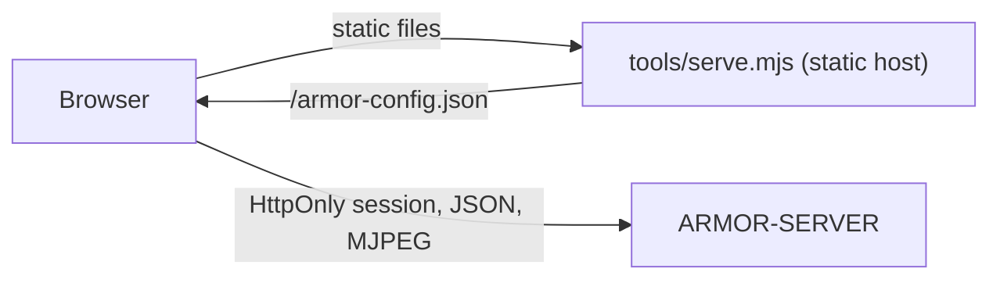

<p align="center">
  
</p>

# 🎛️ ARMOR-STUDIO

<p align="center">
  <a href="README.md">🇺🇸 English</a> |
  <a href="README_spa.md">🇪🇸 Español</a> |
  <a href="README_fra.md">🇫🇷 Français</a> |
  <a href="README_ita.md">🇮🇹 Italiano</a> |
  🇩🇪 <b>Deutsch</b> |
  <a href="README_zho.md">🇨🇳 简体中文</a> |
  <a href="README_jpn.md">🇯🇵 日本語</a>
</p>

### Betriebs- und Entwurfskonsole: Kameras, Radar, Alarme, Solarenergie, Beweise und Standortplan

<p align="center">
  
  
  
  
  
  
</p>

---

**Ehrlichkeitsprüfung - was heute läuft:** Studio spricht mit [ARMOR-SERVER](https://github.com/JuanenRac/ARMOR-SERVER) und ist durch 319 Unit-Tests abgedeckt (Einstellungen lesen, Kameras zusammenführen, die Arithmetik der Solar-Diagramme, jedes Menü in den sieben Sprachen dargestellt, der statische Host). **Nicht belegt** sind Live-Video und PTZ mit jeder echten Kamera, die Solarmenüs mit einem echten Wechselrichter oder einer echten Batterie und eine formale Barrierefreiheits- oder Usability-Prüfung. Solange der Server nicht erreichbar ist, zeigt Studio Demodaten und sagt das in der oberen Leiste.

---

## 🎯 Überblick

**ARMOR-STUDIO** ist die Konsole des Bedieners. Sie hält nie ein Kamerapasswort, eine RTSP-Adresse oder ein Token: sie meldet sich mit Benutzername und Passwort am Server an, erhält eine **HttpOnly**-Sitzung von 8 Stunden, und alles Privilegierte läuft über diese Sitzung.

* **Kameramonitor:** 1, 2, 4, 6, 8, 9, 12 oder 16 Kacheln, die in ihren Rahmen passen (16:9, die ganze Matrix sichtbar, ohne Beschnitt), eine maximierte Ansicht mit begrenztem PTZ-Pad, Schnappschuss und MP4-Aufnahme; eine **Aufnahmebibliothek** zum Filtern, Vorschauen, Abspielen, Schützen und Löschen von Beweisen.
* **Alarme, Geräte und Automatisierungen:** was jetzt einen Menschen braucht, mit Quittieren und dem geschlossenen Protokoll; Rauch-, Gas-, Wasser-, Tür-, Fenster-, Bewegungs-, Klima-, Steckdosen-, Licht-, Sirenen- und Schlossgeräte über WLAN, Zigbee, Bluetooth oder Kabel (Vorlagen für Zigbee2MQTT, Tasmota und Shelly); Regeln, die bei einem Ereignis Geräte schalten; eine große Scharf-/Unscharf-Schaltfläche.
* **Solarenergie:** das Menü *Wechselrichter* zeichnet das Haus als animierten Energiefluss (Module, Netz, Wechselrichter, Batterie und Last, mit Strichen, die bei mehr Leistung schneller laufen), Anzeigen, Messwerte, Warnungen in Worten und Verlaufsdiagramme; das Menü *Batterien* zeigt jeden Stapel mit einem Flüssigkeitspegel, seine **Kapazitäten** (Rest und gesamt, Ah und kWh, Zyklen, Modell), jedes Modul und **jede Zelle** als Balken mit Spannung und Spreizung in Millivolt sowie Diagramme für Ladung, Spannung, Strom, Zellbereich und Temperatur.
* **Übersicht und System:** der Zustand des Perimeters, eine Kachel je Teil, eine Live-Karte des Entwurfs mit jedem Gerät und eine Systemseite mit dem Audit-Protokoll für einen Administrator.
* **Radar:** eine Live-Karte, aus deinem Standortentwurf gezeichnet (Gelände, Gebäude, Kameras, Radare und ihre Abdeckung), mit den Zielen, die jedes Radar meldet, ihrem jüngsten Weg und den Ignorierzonen; Live-Knotenzustand, stumme Knoten als *veraltet*; das eigene Panel jedes Knotens ist einen Klick entfernt.
* **Standortdesigner:** das Gelände zeichnen (Rechteck oder beliebige Form, mit eingetippten Längen), Gebäude mit mehreren Stockwerken und fünf Dacharten platzieren, Türen und Fenster in jedem Stockwerk und jeder Höhe, Lampen, Schornsteine, Solarmodule, Antennen, Pfeiler, Masten, Straßen und Wege, dann Kameras und Radare, wo man will; ein 2D-Plan im CAD-Stil und eine 3D-Ansicht, die man umkreisen, stockwerksweise schneiden und bearbeiten kann; Rückgängig und Wiederholen.
* **Konfiguration:** Serveradresse, Kameras (ONVIF/RTSP), Suche, Benutzer (das eigene Konto und für einen Administrator die Liste von Benutzern, Rollen und Passwörtern), Thema und Sprache; ein portabler Standortexport **ohne Zugangsdaten**.
* **Wetter und Dienste:** Das Menü Dienste listet jedes Programm des Systems und jeden Feldknoten, laufend oder nicht, nach Familien; das Menü Wetter zeigt das Wetter des gewählten Ortes (jetzt, der Regen der nächsten Stunde, aus der Vorhersage abgeleitete Hinweise, 48 Stunden und 10 Tage, Luft und Pollen, Sonne und Mond) mit einem Live-Radar für Regen und Wolken.
* **Die Maschine und das Netz:** *Die Maschine, live* zeigt CPU, Speicher, Laufwerke, Temperatur und Netz des Rechners, auf dem der Server läuft; im Netzwerk-Menü kann ein Bediener einen Scan, einen Ping, einen Traceroute, die Ports oder die Webseite eines Geräts anfordern, und ein Administrator kann den Zugang eines Geräts hinterlegen (verschlüsselt auf dem Server, nie wieder angezeigt), damit *Prüfen* Modell und Firmware liest und vor einem Werkszugang warnt. Konfiguration -> Allgemein hat eine Schaltfläche, die die Serveradresse prüft und ein falsches http/https von einem ausgefallenen Server unterscheidet.
* **Sieben Sprachen** (Englisch, Spanisch, Deutsch, Französisch, Italienisch, Japanisch, Chinesisch) und sechzehn Themen, das Standardthema heißt *Armor*.
* **Deklariere dein Gerät:** in den Menüs Wechselrichter und Batterien fügst du jeden Wechselrichter oder Batteriestapel mit Name, Modell (Voltronic, MPP Solar, Pylontech US2000 / US3000 / US5000, ANT-BMS), Anschluss (RS232, RS485, USB, CAN, WLAN) und Gateway-Knoten hinzu; es wartet auf seinen ersten echten Messwert, und mit *Beispielwerte zeigen* lässt sich das Menü inzwischen ausprobieren.
* **Elektroplaner:** zeichnen Sie den Stromlaufplan des Hauses (Netz, Zähler, Schutzorgane, Umschalter, Verteilung, PV, Wechselrichter, Batterien und Verbraucher, AC und DC) mit Anschlüssen und Leitungen, gruppieren Sie ihn in Tafeln, verbinden Sie Wechselrichter und Batterien mit den vom Server gelesenen Solargeräten, um ihre Live-Werte zu sehen, und lassen Sie die Prüfungen ihn durchsehen (zwei Quellen an einer Leitung, Schutzschalter und Kabel gegen den Strom, fehlende Schutzorgane, DC-Spannungen). Die Zeichnung liegt auf dem Server; es ist eine Zeichnung: noch schaltet oder misst nichts.

## 🔄 Architektur



## 🔒 Sicherheitsmodell

* **Keine Geheimnisse im Browser.** Kamerapasswörter werden einmal eingegeben, an den Server gesendet und danach nur als maskierter Zustand „gespeichert“ gezeigt. Standortexporte lassen Benutzernamen und Zugangsdaten-Markierungen weg.
* **Gespeicherte Einstellungen sind nicht vertrauenswürdige Eingabe.** Sie werden Wert für Wert gelesen: ein ungültiger Ursprung, ein ungültiges Thema, eine ungültige Sprache oder Form wird verworfen, Positionen werden begrenzt und Listen gekappt.
* **Keine Anfragen an Dritte, außer im Menü Wetter, und nur nach dem Einschalten.** Schriften sind lokal; der statische Host sendet `Content-Security-Policy: default-src 'self'` beschränkt auf den konfigurierten Server, `frame-ancestors 'none'`, `nosniff` und `no-referrer`.
* Live-Video wird nur über eine Stream-Adresse gezeigt, die der Server einem Operator ausstellt.
* **Knoten-Firmware und Meldungen:** *Konfiguration > Firmware* aktualisiert einen Knoten oder alle eines Typs aus einer Datei oder dem GitHub-Release, mit Fortschrittsbalken je Knoten und erklärten Schritten; *Benachrichtigungen* verbindet die Alarme mit Telegram und Home Assistant und sendet einen Test. Konfigurationsdateien, Dienste und der Broker des Systems werden dort ebenfalls bearbeitet, über den Administrationsagenten der Maschine.

## 📂 Struktur des Repositorys

```text
ARMOR-STUDIO/
├── src/
│   ├── App.tsx, domain.ts, settings.ts, cameras.ts, hooks.ts, api.ts, config.ts, i18n.ts
│   ├── components/   camera, chrome, SiteMap
│   ├── views/        overview, monitoring, RadarView, RadarSensors, AlarmsView, DevicesView, AutomationsView, InvertersView, BatteriesView, SystemView
│   ├── designer/     geometry, ops, model, Plan2D, Viewport3D, Toolbox, Inspector
│   ├── electrical/   the Electrical Designer: model, ops, analysis (the checks), presets, symbols, sync
│   ├── solarModel.ts, solarGraphics.tsx, solarText.ts   the arithmetic, the drawings and the words of the solar menus
│   └── ...           ConfigurationPanel, UsersPanel, MediaLibrary, HistoryView, SiteDesignerInteractive, StudioLogin, one *Text.ts per area (7 languages)
├── tools/            serve.mjs (+ tests)
├── docs/             security model
└── images/           brand assets
```

## 🛠️ Entwicklungsumgebung

```powershell
npm install
npm run dev         # http://127.0.0.1:5178 against a server on 127.0.0.1:8080
npm run typecheck
npm test            # 319 tests: designer geometry, settings, cameras, radar map, solar arithmetic, the electrical designer, every menu in seven languages, static host
npm run build       # dist/
$env:ARMOR_SERVER_ORIGIN="http://192.168.0.180:18080"; node tools/serve.mjs   # serve the build
```

`tools/serve.mjs` liest `ARMOR_STUDIO_HOST` (Standard `127.0.0.1`), `ARMOR_STUDIO_PORT` (`5178`), `ARMOR_STUDIO_DIST` und `ARMOR_SERVER_ORIGIN`. Zur Installation des ganzen Stacks auf dem CM5-Prüfstand siehe [ARMOR-DEVOPS](https://github.com/JuanenRac/ARMOR-DEVOPS).

## 🔗 Verwandte Projekte

**A.R.M.O.R.** (Autonomous Radar & Multimodal Observation Range) ist ein Perimeter-Sicherheitssystem aus unabhängigen Repositorys. Jedes hat eine eigene Version, eigene Tests und ein eigenes README; hier ist die Familie:

* **[ARMOR-COMMON](https://github.com/JuanenRac/ARMOR-COMMON)** - Nachrichtenverträge, Validierer, Konformitätsvektoren und generierte Typen
* **[ARMOR-RADAR](https://github.com/JuanenRac/ARMOR-RADAR)** - Feldknoten-Firmware für ESP32-S3 mit drei Radaren und eigenem Web-Panel
* **[ARMOR-SOLAR](https://github.com/JuanenRac/ARMOR-SOLAR)** - Protokolle für Solar-Wechselrichter und -Batterien und die Nachrichten eines Gateway-Knotens
* **[ARMOR-ELECTRICAL](https://github.com/JuanenRac/ARMOR-ELECTRICAL)** - Elektroknoten: Zähler, die Nachricht der Netzmesswerte und die Regeln fürs Schalten
* **[ARMOR-ALARM](https://github.com/JuanenRac/ARMOR-ALARM)** - Alarmknoten und Alarmzentrale: Zonen, Scharfschalten, Verzögerungen, Sirene und PIN, mit dem Server oder ohne ihn
* **[ARMOR-HMI](https://github.com/JuanenRac/ARMOR-HMI)** - Touch-Panel: der Systemzustand auf einem Wandbildschirm, Scharf- und Quittieren sowie das Zuhause des Sprachassistenten
* **[ARMOR-NETWORK](https://github.com/JuanenRac/ARMOR-NETWORK)** - Das lokale Netzwerk: seine Geräte, das Internet und was sich ändert
* **[ARMOR-SERVER](https://github.com/JuanenRac/ARMOR-SERVER)** - Zentraler Koordinator: Telemetrie, Alarme, Geräte, Solarmesswerte und Kameras
* **ARMOR-STUDIO** (dieses Repository) - Web-Konsole: Kameras, Radar, Alarme, Solarenergie und 2D/3D-Standortdesigner
* **[ARMOR-ANDROID-CONTROL](https://github.com/JuanenRac/ARMOR-ANDROID-CONTROL)** - Android-Bedienclient mit Live-Radar in 2D/3D
* **[ARMOR-SERVER-AI](https://github.com/JuanenRac/ARMOR-SERVER-AI)** - Visuelle Inferenzrichtlinie, die ihre Entscheidungen erklärt und nie handelt
* **[ARMOR-VOICE-AI](https://github.com/JuanenRac/ARMOR-VOICE-AI)** - Offline-Sprachabsichten mit einer nicht fälschbaren Bestätigung
* **[ARMOR-HARDWARE](https://github.com/JuanenRac/ARMOR-HARDWARE)** - Gehäuse, Elektronik und die Abnahmematrix am Prüfstand
* **[ARMOR-DEVOPS](https://github.com/JuanenRac/ARMOR-DEVOPS)** - Bereitstellung, CM5-Prüfstand, Backup und TLS
* **[ARMOR-SIMULATOR](https://github.com/JuanenRac/ARMOR-SIMULATOR)** - Offline-Telemetriesimulator mit wiederholbaren Fehlern
* **[ARMOR-UPDATER](https://github.com/JuanenRac/ARMOR-UPDATER)** - Erkennt, installiert und aktualisiert die eigenen Repositories des Ökosystems
* **[ARMOR-DOCS](https://github.com/JuanenRac/ARMOR-DOCS)** - Architektur, Sicherheitsgrundlage und die Fähigkeitsmatrix

## 📚 Dokumentation und Community

Hier gibt es mehr zu lesen:

* [Fähigkeitsmatrix: was belegt ist und was nicht](https://github.com/JuanenRac/ARMOR-DOCS/blob/main/docs/CAPABILITY_MATRIX.md)
* [Projektkatalog: Versionen und wie die Repositorys voneinander abhängen](https://github.com/JuanenRac/ARMOR-DOCS/blob/main/docs/PROJECT_CATALOG.md)
* [Änderungsverlauf dieses Repositorys](CHANGELOG.md)
* [Lizenz (GPL-3.0-or-later)](LICENSE)
* Fragen, Ideen und Meldungen: electrohobby3d@gmail.com

## 👤 AUTOR

**JuanenRac (Electro Hobby 3D)** · electrohobby3d@gmail.com

## 📜 LIZENZ

GPL-3.0-or-later - siehe [LICENSE](LICENSE).
