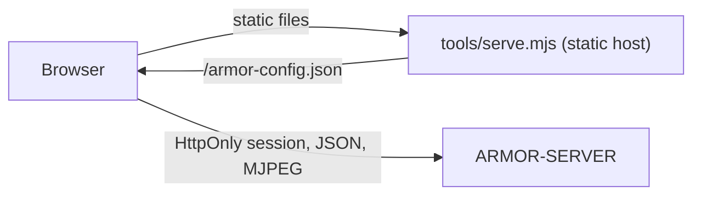

<p align="center">
  
</p>

# 🎛️ ARMOR-STUDIO

<p align="center">
  <a href="README.md">🇺🇸 English</a> |
  <a href="README_spa.md">🇪🇸 Español</a> |
  🇫🇷 <b>Français</b> |
  <a href="README_ita.md">🇮🇹 Italiano</a> |
  <a href="README_deu.md">🇩🇪 Deutsch</a> |
  <a href="README_zho.md">🇨🇳 简体中文</a> |
  <a href="README_jpn.md">🇯🇵 日本語</a>
</p>

### Console d'exploitation et de conception : caméras, radar, alarmes, énergie solaire, preuves et plan du site

<p align="center">
  
  
  
  
  
  
</p>

---

**Vérification d'honnêteté - ce qui fonctionne aujourd'hui:** Studio dialogue avec [ARMOR-SERVER](https://github.com/JuanenRac/ARMOR-SERVER) et est couvert par 312 tests unitaires (lecture des réglages, fusion des caméras, arithmétique des graphiques solaires, chaque menu affiché dans les sept langues, hôte statique). Ne sont **pas** prouvés : la vidéo en direct et le PTZ avec chaque vraie caméra, les menus solaires avec un vrai onduleur ou une vraie batterie, ni une revue formelle d'accessibilité ou d'utilisabilité. Tant que le serveur est injoignable, Studio affiche des données de démonstration et le dit dans la barre supérieure.

---

## 🎯 Présentation

**ARMOR-STUDIO** est la console de l'opérateur. Elle ne détient jamais un mot de passe de caméra, une adresse RTSP ni un jeton : elle se connecte au serveur avec un nom et un mot de passe, reçoit une session **HttpOnly** de 8 heures, et tout ce qui est privilégié passe par cette session.

* **Moniteur de caméras :** 1, 2, 4, 6, 8, 9, 12 ou 16 vignettes qui s'ajustent à leur cadre (16:9, toute la matrice visible, sans rognage), une vue agrandie avec manette PTZ bornée, capture et enregistrement MP4 ; une **bibliothèque d'enregistrements** pour filtrer, prévisualiser, lire, protéger et supprimer les preuves.
* **Alarmes, appareils et automatisations :** ce qui exige une personne maintenant avec acquittement et le registre clos ; appareils de fumée, gaz, inondation, porte, fenêtre, mouvement, climat, prise, lumière, sirène et serrure par Wi-Fi, Zigbee, Bluetooth ou câble (préréglages Zigbee2MQTT, Tasmota et Shelly) ; règles qui commandent des appareils lors d'un événement ; un grand bouton armer / désarmer.
* **Énergie solaire :** le menu *Onduleurs* dessine la maison comme un flux d'énergie animé (panneaux, réseau, onduleur, batterie et charge, avec des tirets d'autant plus rapides que la puissance est grande), jauges, relevés, avertissements en toutes lettres et graphiques d'historique ; le menu *Batteries* montre chaque pile avec un niveau de liquide, ses **capacités** (restante et totale, Ah et kWh, cycles, modèle), chaque module et **chaque cellule** en barre avec sa tension et l'écart en millivolts, et des graphiques de charge, tension, courant, plage des cellules et température.
* **Vue d'ensemble et système :** l'état du périmètre, une tuile par partie, une carte vivante du plan avec chaque appareil et une page système avec la piste d'audit pour un administrateur.
* **Radar :** une carte en direct dessinée à partir de votre plan du site (terrain, bâtiments, caméras, radars et leur couverture) avec les cibles que chaque radar rapporte, leur trajet récent et les zones ignorées ; état des nœuds en direct, les nœuds muets étant *périmés* ; le panneau propre de chaque nœud est à un clic.
* **Concepteur de site :** dessinez le terrain (rectangle ou forme quelconque, avec longueurs saisies), placez des bâtiments de plusieurs étages avec cinq types de toit, portes et fenêtres à tout étage et hauteur, lampadaires, cheminées, panneaux solaires, antennes, piliers, mâts, routes et chemins, puis caméras et radars où vous voulez ; un plan 2D de type CAO et une vue 3D que l'on peut orbiter, couper étage par étage et modifier ; annuler et rétablir.
* **Configuration :** adresse du serveur, caméras (ONVIF/RTSP), découverte, utilisateurs (votre compte et, pour un administrateur, la liste des utilisateurs, rôles et mots de passe), thème et langue ; un export portable du site **sans identifiants**.
* **Météo et services :** le menu Services liste chaque programme du système et chaque nœud de terrain, actif ou non, par famille ; le menu Météo montre la météo du lieu choisi (maintenant, la pluie de l'heure à venir, des avis déduits des prévisions, 48 heures et 10 jours, l'air et le pollen, le soleil et la lune) avec un radar en direct de la pluie et des nuages.
* **La machine et le réseau :** *La machine, en direct* montre le CPU, la mémoire, les disques, la température et le réseau de l'ordinateur où tourne le serveur ; dans le menu Réseau un opérateur peut demander un balayage, un ping, un traceroute, les ports ou la page web d'un appareil, et un administrateur peut enregistrer l'accès d'un appareil (chiffré sur le serveur et jamais réaffiché) pour que *Inspecter* lise son modèle et son firmware et signale un accès d'usine. Configuration -> Général a un bouton qui vérifie l'adresse du serveur et distingue un mauvais http/https d'un serveur en panne.
* **Sept langues** (anglais, espagnol, allemand, français, italien, japonais, chinois) et seize thèmes, celui par défaut s'appelant *Armor*.
* **Déclarez votre équipement :** dans les menus Onduleurs et Batteries, vous ajoutez chaque onduleur ou pile de batteries avec son nom, son modèle (Voltronic, MPP Solar, Pylontech US2000 / US3000 / US5000, ANT-BMS), sa connexion (RS232, RS485, USB, CAN, Wi-Fi) et son nœud passerelle ; il attend son premier relevé réel, et *Voir des relevés d'exemple* permet d'essayer le menu en attendant.
* **Concepteur électrique :** dessinez le schéma électrique de la maison (réseau, compteur, protections, commutateurs, distribution, PV, onduleurs, batteries et charges, AC et DC) avec ports et câbles, regroupez-le en tableaux, reliez onduleurs et batteries aux appareils solaires lus par le serveur pour voir leurs valeurs en direct, et laissez les contrôles le relire (deux sources sur une ligne, disjoncteurs et câbles face au courant, protections manquantes, tensions DC). Le dessin est conservé sur le serveur ; c'est un dessin : rien ne commande ni ne mesure encore.

## 🔄 Architecture



## 🔒 Modèle de sécurité

* **Aucun secret dans le navigateur.** Les mots de passe des caméras sont saisis une fois, envoyés au serveur et ensuite affichés seulement comme un état « enregistré » masqué. Les exports du site suppriment les noms d'utilisateur et les indicateurs d'identifiants.
* **Les réglages stockés sont une entrée non fiable.** Ils sont lus valeur par valeur : une origine, un thème, une langue ou une forme invalides sont écartés, les positions sont bornées et les listes plafonnées.
* **Aucune requête vers un tiers, sauf le menu Météo, et seulement après activation.** Les polices sont locales ; l'hôte statique envoie `Content-Security-Policy: default-src 'self'` limitée au serveur configuré, `frame-ancestors 'none'`, `nosniff` et `no-referrer`.
* La vidéo en direct n'est montrée que par une adresse de flux que le serveur délivre à un opérateur.
* **Micrologiciel des nœuds et avis :** *Configuration > Micrologiciel* met à jour un nœud ou tous ceux d'un type depuis un fichier ou la version GitHub, avec une barre de progression par nœud et les étapes expliquées ; *Notifications* relie les alarmes à Telegram et Home Assistant et envoie un essai . Les fichiers de configuration, les services et le broker du système s'y modifient aussi, via l'agent d'administration de la machine.

## 📂 Structure du dépôt

```text
ARMOR-STUDIO/
├── src/
│   ├── App.tsx, domain.ts, settings.ts, cameras.ts, hooks.ts, api.ts, config.ts, i18n.ts
│   ├── components/   camera, chrome, SiteMap
│   ├── views/        overview, monitoring, RadarView, RadarSensors, AlarmsView, DevicesView, AutomationsView, InvertersView, BatteriesView, SystemView
│   ├── designer/     geometry, ops, model, Plan2D, Viewport3D, Toolbox, Inspector
│   ├── electrical/   the Electrical Designer: model, ops, analysis (the checks), presets, symbols, sync
│   ├── solarModel.ts, solarGraphics.tsx, solarText.ts   the arithmetic, the drawings and the words of the solar menus
│   └── ...           ConfigurationPanel, UsersPanel, MediaLibrary, HistoryView, SiteDesignerInteractive, StudioLogin, one *Text.ts per area (7 languages)
├── tools/            serve.mjs (+ tests)
├── docs/             security model
└── images/           brand assets
```

## 🛠️ Environnement de développement

```powershell
npm install
npm run dev         # http://127.0.0.1:5178 against a server on 127.0.0.1:8080
npm run typecheck
npm test            # 312 tests: designer geometry, settings, cameras, radar map, solar arithmetic, the electrical designer, every menu in seven languages, static host
npm run build       # dist/
$env:ARMOR_SERVER_ORIGIN="http://192.168.0.180:18080"; node tools/serve.mjs   # serve the build
```

`tools/serve.mjs` lit `ARMOR_STUDIO_HOST` (par défaut `127.0.0.1`), `ARMOR_STUDIO_PORT` (`5178`), `ARMOR_STUDIO_DIST` et `ARMOR_SERVER_ORIGIN`. Pour installer toute la pile sur le banc d'essai CM5, voir [ARMOR-DEVOPS](https://github.com/JuanenRac/ARMOR-DEVOPS).

## 🔗 Projets liés

**A.R.M.O.R.** (Autonomous Radar & Multimodal Observation Range) est un système de sécurité périmétrique composé de dépôts indépendants. Chacun a sa propre version, ses propres tests et son propre README ; voici la famille :

* **[ARMOR-COMMON](https://github.com/JuanenRac/ARMOR-COMMON)** - Contrats de messages, validateurs, vecteurs de conformité et types générés
* **[ARMOR-RADAR](https://github.com/JuanenRac/ARMOR-RADAR)** - Firmware du nœud de terrain pour ESP32-S3 avec trois radars et son propre panneau web
* **[ARMOR-SOLAR](https://github.com/JuanenRac/ARMOR-SOLAR)** - Protocoles des onduleurs et batteries solaires et messages d'un nœud passerelle
* **[ARMOR-ELECTRICAL](https://github.com/JuanenRac/ARMOR-ELECTRICAL)** - Nœud électrique : compteurs, le message des mesures du réseau et les règles de commutation
* **[ARMOR-HMI](https://github.com/JuanenRac/ARMOR-HMI)** - Panneau tactile : l'état du système sur un écran mural, armer et acquitter, et la maison de l'assistant vocal
* **[ARMOR-NETWORK](https://github.com/JuanenRac/ARMOR-NETWORK)** - Le réseau local : ses appareils, internet et ce qui change
* **[ARMOR-SERVER](https://github.com/JuanenRac/ARMOR-SERVER)** - Coordinateur central : télémétrie, alarmes, appareils, relevés solaires et caméras
* **ARMOR-STUDIO** (ce dépôt) - Console web : caméras, radar, alarmes, énergie solaire et concepteur de site 2D/3D
* **[ARMOR-ANDROID-CONTROL](https://github.com/JuanenRac/ARMOR-ANDROID-CONTROL)** - Client Android de l'opérateur avec radar 2D/3D en direct
* **[ARMOR-SERVER-AI](https://github.com/JuanenRac/ARMOR-SERVER-AI)** - Politique d'inférence visuelle qui explique ses décisions et n'agit jamais
* **[ARMOR-VOICE-AI](https://github.com/JuanenRac/ARMOR-VOICE-AI)** - Intentions vocales hors ligne avec une confirmation impossible à falsifier
* **[ARMOR-HARDWARE](https://github.com/JuanenRac/ARMOR-HARDWARE)** - Boîtiers, électronique et matrice d'acceptation sur banc
* **[ARMOR-DEVOPS](https://github.com/JuanenRac/ARMOR-DEVOPS)** - Déploiement, banc d'essai CM5, sauvegarde et TLS
* **[ARMOR-SIMULATOR](https://github.com/JuanenRac/ARMOR-SIMULATOR)** - Simulateur de télémétrie hors ligne avec des pannes reproductibles
* **[ARMOR-UPDATER](https://github.com/JuanenRac/ARMOR-UPDATER)** - Détecte, installe et met à jour les propres dépôts de l'écosystème
* **[ARMOR-DOCS](https://github.com/JuanenRac/ARMOR-DOCS)** - Architecture, base de sécurité et matrice des capacités

## 📚 Documentation et communauté

Pour en savoir plus :

* [Matrice des capacités : ce qui est prouvé et ce qui ne l'est pas](https://github.com/JuanenRac/ARMOR-DOCS/blob/main/docs/CAPABILITY_MATRIX.md)
* [Catalogue des projets : versions et dépendances entre les dépôts](https://github.com/JuanenRac/ARMOR-DOCS/blob/main/docs/PROJECT_CATALOG.md)
* [Historique des modifications de ce dépôt](CHANGELOG.md)
* [Licence (GPL-3.0-or-later)](LICENSE)
* Questions, idées et rapports : electrohobby3d@gmail.com

## 👤 AUTEUR

**JuanenRac (Electro Hobby 3D)** · electrohobby3d@gmail.com

## 📜 LICENCE

GPL-3.0-or-later - voir [LICENSE](LICENSE).
