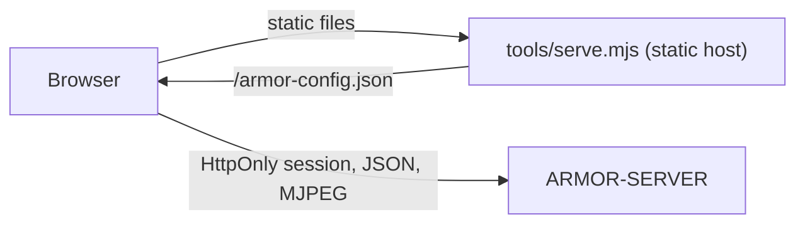

<p align="center">
  
</p>

# 🎛️ ARMOR-STUDIO

<p align="center">
  <a href="README.md">🇺🇸 English</a> |
  <a href="README_spa.md">🇪🇸 Español</a> |
  <a href="README_fra.md">🇫🇷 Français</a> |
  🇮🇹 <b>Italiano</b> |
  <a href="README_deu.md">🇩🇪 Deutsch</a> |
  <a href="README_zho.md">🇨🇳 简体中文</a> |
  <a href="README_jpn.md">🇯🇵 日本語</a>
</p>

### Console di esercizio e progettazione: telecamere, radar, allarmi, energia solare, prove e planimetria del sito

<p align="center">
  
  
  
  
  
  
</p>

---

**Controllo di onestà - cosa funziona oggi:** Studio dialoga con [ARMOR-SERVER](https://github.com/JuanenRac/ARMOR-SERVER) ed è coperto da 312 test unitari (lettura delle impostazioni, unione delle telecamere, aritmetica dei grafici solari, ogni menu mostrato nelle sette lingue, host statico). **Non** sono provati: il video dal vivo e il PTZ con ogni telecamera reale, i menu solari con un vero inverter o batteria, né una revisione formale di accessibilità o usabilità. Finché il server non è raggiungibile, Studio mostra dati dimostrativi e lo dice nella barra superiore.

---

## 🎯 Panoramica

**ARMOR-STUDIO** è la console dell'operatore. Non detiene mai una password di telecamera, un indirizzo RTSP o un token: accede al server con nome utente e password, riceve una sessione **HttpOnly** di 8 ore e tutto ciò che è privilegiato passa da quella sessione.

* **Monitor delle telecamere:** 1, 2, 4, 6, 8, 9, 12 o 16 riquadri che si adattano alla cornice (16:9, tutta la matrice visibile, senza ritagli), una vista ingrandita con joystick PTZ limitato, istantanea e registrazione MP4; una **libreria delle registrazioni** per filtrare, visualizzare, riprodurre, proteggere ed eliminare le prove.
* **Allarmi, dispositivi e automazioni:** ciò che richiede una persona adesso con riconoscimento e registro chiuso; dispositivi di fumo, gas, allagamento, porta, finestra, movimento, clima, presa, luce, sirena e serratura via Wi-Fi, Zigbee, Bluetooth o cavo (preimpostazioni per Zigbee2MQTT, Tasmota e Shelly); regole che comandano dispositivi quando succede qualcosa; un grande pulsante inserisci / disinserisci.
* **Energia solare:** il menu *Inverter* disegna la casa come un flusso di energia animato (pannelli, rete, inverter, batteria e carico, con trattini più veloci quanta più potenza c'è), indicatori, letture, avvisi in parole e grafici di storico; il menu *Batterie* mostra ogni pacco con un livello di liquido, le sue **capacità** (residua e totale, Ah e kWh, cicli, modello), ogni modulo e **ogni cella** come barra con la sua tensione e la differenza in millivolt, e grafici di carica, tensione, corrente, intervallo delle celle e temperatura.
* **Panoramica e sistema:** lo stato del perimetro, un riquadro per parte, una mappa viva del progetto con ogni dispositivo e una pagina di sistema con la traccia di audit per un amministratore.
* **Radar:** una mappa dal vivo disegnata dal tuo progetto del sito (terreno, edifici, telecamere, radar e loro copertura) con i bersagli che ogni radar segnala, il loro percorso recente e le zone ignorate; stato dei nodi dal vivo, con i nodi muti mostrati come *obsoleti*; il pannello proprio di ogni nodo è a un clic.
* **Progettista del sito:** disegna il terreno (rettangolo o qualsiasi forma, con lunghezze digitate), posiziona edifici di più piani con cinque tipi di tetto, porte e finestre a qualsiasi piano e altezza, lampioni, camini, pannelli solari, antenne, pilastri, pali, strade e sentieri, poi telecamere e radar dove vuoi; una pianta 2D in stile CAD e una vista 3D che puoi orbitare, tagliare piano per piano e modificare; annulla e ripeti.
* **Configurazione:** indirizzo del server, telecamere (ONVIF/RTSP), scoperta, utenti (il tuo account e, per un amministratore, l'elenco di utenti, ruoli e password), tema e lingua; un'esportazione portatile del sito **senza credenziali**.
* **Meteo e servizi:** il menu Servizi elenca ogni programma del sistema e ogni nodo di campo, attivo o no, per famiglia; il menu Meteo mostra il meteo del luogo scelto (adesso, la pioggia della prossima ora, avvisi dedotti dalle previsioni, 48 ore e 10 giorni, aria e polline, sole e luna) con un radar dal vivo di pioggia e nuvole.
* **La macchina e la rete:** *La macchina, dal vivo* mostra CPU, memoria, dischi, temperatura e rete del computer su cui gira il server; nel menu Rete un operatore può ordinare una scansione, un ping, un traceroute, le porte o la pagina web di un dispositivo, e un amministratore può salvare l'accesso di un dispositivo (cifrato sul server e mai più mostrato) perché *Ispeziona* legga modello e firmware e avvisi di un accesso di fabbrica. Configurazione -> Generale ha un pulsante che controlla l'indirizzo del server e distingue un http/https sbagliato da un server spento.
* **Sette lingue** (inglese, spagnolo, tedesco, francese, italiano, giapponese, cinese) e sedici temi, quello predefinito chiamato *Armor*.
* **Dichiara il tuo dispositivo:** nei menu Inverter e Batterie aggiungi ogni inverter o pacco batterie con nome, modello (Voltronic, MPP Solar, Pylontech US2000 / US3000 / US5000, ANT-BMS), collegamento (RS232, RS485, USB, CAN, Wi-Fi) e nodo gateway; attende la prima lettura reale e *Mostra letture di esempio* permette di provare il menu nel frattempo.
* **Progettista elettrico:** disegna lo schema elettrico della casa (rete, contatore, protezioni, commutatori, distribuzione, FV, inverter, batterie e carichi, in AC e DC) con porte e cavi, raggruppalo in quadri, collega inverter e batterie ai dispositivi solari letti dal server per vedere i loro valori in tempo reale e lascia che i controlli lo rivedano (due sorgenti su una linea, magnetotermici e cavi rispetto alla corrente, protezioni mancanti, tensioni DC). Il disegno è conservato sul server; è un disegno: per ora nulla comanda o misura.

## 🔄 Architettura



## 🔒 Modello di sicurezza

* **Nessun segreto nel browser.** Le password delle telecamere si digitano una volta, si inviano al server e poi si vedono solo come stato «salvata» mascherato. Le esportazioni del sito omettono nomi utente e indicatori di credenziali.
* **Le impostazioni salvate sono input non attendibile.** Sono lette valore per valore: un'origine, un tema, una lingua o una forma non validi vengono scartati, le posizioni limitate e le liste contenute.
* **Nessuna richiesta a terzi, tranne il menu Meteo, e solo dopo averlo attivato.** I caratteri sono locali; l'host statico invia `Content-Security-Policy: default-src 'self'` limitata al server configurato, `frame-ancestors 'none'`, `nosniff` e `no-referrer`.
* Il video dal vivo si mostra solo tramite un indirizzo di flusso che il server rilascia a un operatore.
* **Firmware dei nodi e avvisi:** *Configurazione > Firmware* aggiorna un nodo o tutti quelli di un tipo da un file o dalla release di GitHub, con una barra di avanzamento per nodo e i passaggi spiegati; *Notifiche* collega gli allarmi a Telegram e Home Assistant e invia una prova. Anche i file di configurazione, i servizi e il broker del sistema si modificano lì, tramite l'agente di amministrazione della macchina.

## 📂 Struttura del repository

```text
ARMOR-STUDIO/
├── src/
│   ├── App.tsx, domain.ts, settings.ts, cameras.ts, hooks.ts, api.ts, config.ts, i18n.ts
│   ├── components/   camera, chrome, SiteMap
│   ├── views/        overview, monitoring, RadarView, RadarSensors, AlarmsView, DevicesView, AutomationsView, InvertersView, BatteriesView, SystemView
│   ├── designer/     geometry, ops, model, Plan2D, Viewport3D, Toolbox, Inspector
│   ├── electrical/   the Electrical Designer: model, ops, analysis (the checks), presets, symbols, sync
│   ├── solarModel.ts, solarGraphics.tsx, solarText.ts   the arithmetic, the drawings and the words of the solar menus
│   └── ...           ConfigurationPanel, UsersPanel, MediaLibrary, HistoryView, SiteDesignerInteractive, StudioLogin, one *Text.ts per area (7 languages)
├── tools/            serve.mjs (+ tests)
├── docs/             security model
└── images/           brand assets
```

## 🛠️ Ambiente di sviluppo

```powershell
npm install
npm run dev         # http://127.0.0.1:5178 against a server on 127.0.0.1:8080
npm run typecheck
npm test            # 312 tests: designer geometry, settings, cameras, radar map, solar arithmetic, the electrical designer, every menu in seven languages, static host
npm run build       # dist/
$env:ARMOR_SERVER_ORIGIN="http://192.168.0.180:18080"; node tools/serve.mjs   # serve the build
```

`tools/serve.mjs` legge `ARMOR_STUDIO_HOST` (predefinito `127.0.0.1`), `ARMOR_STUDIO_PORT` (`5178`), `ARMOR_STUDIO_DIST` e `ARMOR_SERVER_ORIGIN`. Per installare tutto lo stack sul banco di prova CM5 vedi [ARMOR-DEVOPS](https://github.com/JuanenRac/ARMOR-DEVOPS).

## 🔗 Progetti correlati

**A.R.M.O.R.** (Autonomous Radar & Multimodal Observation Range) è un sistema di sicurezza perimetrale fatto di repository indipendenti. Ognuno ha la propria versione, i propri test e il proprio README; ecco la famiglia:

* **[ARMOR-COMMON](https://github.com/JuanenRac/ARMOR-COMMON)** - Contratti dei messaggi, validatori, vettori di conformità e tipi generati
* **[ARMOR-RADAR](https://github.com/JuanenRac/ARMOR-RADAR)** - Firmware del nodo di campo per ESP32-S3 con tre radar e un proprio pannello web
* **[ARMOR-SOLAR](https://github.com/JuanenRac/ARMOR-SOLAR)** - Protocolli di inverter e batterie solari e messaggi di un nodo gateway
* **[ARMOR-ELECTRICAL](https://github.com/JuanenRac/ARMOR-ELECTRICAL)** - Nodo elettrico: contatori, il messaggio delle letture della rete e le regole di manovra
* **[ARMOR-HMI](https://github.com/JuanenRac/ARMOR-HMI)** - Pannello touch: lo stato del sistema su uno schermo a parete, attivare e riconoscere gli allarmi, e la casa dell'assistente vocale
* **[ARMOR-NETWORK](https://github.com/JuanenRac/ARMOR-NETWORK)** - La rete locale: i suoi dispositivi, internet e ciò che cambia
* **[ARMOR-SERVER](https://github.com/JuanenRac/ARMOR-SERVER)** - Coordinatore centrale: telemetria, allarmi, dispositivi, letture solari e telecamere
* **ARMOR-STUDIO** (questo repository) - Console web: telecamere, radar, allarmi, energia solare e progettista del sito 2D/3D
* **[ARMOR-ANDROID-CONTROL](https://github.com/JuanenRac/ARMOR-ANDROID-CONTROL)** - Client Android dell'operatore con radar 2D/3D in tempo reale
* **[ARMOR-SERVER-AI](https://github.com/JuanenRac/ARMOR-SERVER-AI)** - Politica di inferenza visiva che spiega le sue decisioni e non agisce mai
* **[ARMOR-VOICE-AI](https://github.com/JuanenRac/ARMOR-VOICE-AI)** - Intenti vocali offline con una conferma impossibile da falsificare
* **[ARMOR-HARDWARE](https://github.com/JuanenRac/ARMOR-HARDWARE)** - Contenitori, elettronica e matrice di accettazione da banco
* **[ARMOR-DEVOPS](https://github.com/JuanenRac/ARMOR-DEVOPS)** - Distribuzione, banco di prova CM5, backup e TLS
* **[ARMOR-SIMULATOR](https://github.com/JuanenRac/ARMOR-SIMULATOR)** - Simulatore di telemetria offline con guasti ripetibili
* **[ARMOR-UPDATER](https://github.com/JuanenRac/ARMOR-UPDATER)** - Rileva, installa e aggiorna i repository stessi dell'ecosistema
* **[ARMOR-DOCS](https://github.com/JuanenRac/ARMOR-DOCS)** - Architettura, base di sicurezza e matrice delle capacità

## 📚 Documentazione e comunità

Dove leggere di più:

* [Matrice delle capacità: cosa è provato e cosa no](https://github.com/JuanenRac/ARMOR-DOCS/blob/main/docs/CAPABILITY_MATRIX.md)
* [Catalogo dei progetti: versioni e dipendenze tra i repository](https://github.com/JuanenRac/ARMOR-DOCS/blob/main/docs/PROJECT_CATALOG.md)
* [Cronologia delle modifiche di questo repository](CHANGELOG.md)
* [Licenza (GPL-3.0-or-later)](LICENSE)
* Domande, idee e segnalazioni: electrohobby3d@gmail.com

## 👤 AUTORE

**JuanenRac (Electro Hobby 3D)** · electrohobby3d@gmail.com

## 📜 LICENZA

GPL-3.0-or-later - vedi [LICENSE](LICENSE).
