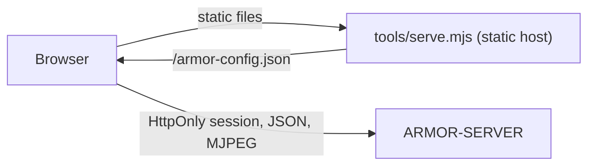

<p align="center">
  
</p>

# 🎛️ ARMOR-STUDIO

<p align="center">
  <a href="README.md">🇺🇸 English</a> |
  <a href="README_spa.md">🇪🇸 Español</a> |
  <a href="README_fra.md">🇫🇷 Français</a> |
  <a href="README_ita.md">🇮🇹 Italiano</a> |
  <a href="README_deu.md">🇩🇪 Deutsch</a> |
  <a href="README_zho.md">🇨🇳 简体中文</a> |
  🇯🇵 <b>日本語</b>
</p>

### 運用と設計のコンソール：カメラ、レーダー、アラーム、太陽光発電、証拠、サイトの平面図

<p align="center">
  
  
  
  
  
  
</p>

---

**正直さのチェック - 今日動いているもの:** Studio は [ARMOR-SERVER](https://github.com/JuanenRac/ARMOR-SERVER) と通信し、314 件の単体テスト（設定の読み取り、カメラの統合、太陽光グラフの計算、7 言語すべてでの各メニューの描画、静的ホスト）で網羅されています。**実証されていないもの：** すべての実カメラでのライブ映像と PTZ、実際のインバーターやバッテリーでの太陽光メニュー、そして正式なアクセシビリティやユーザビリティの評価。サーバーに接続できない間、Studio はデモデータを表示し、上部バーでそう伝えます。

---

## 🎯 概要

**ARMOR-STUDIO** はオペレーターのコンソールです。カメラのパスワード、RTSP アドレス、トークンを決して持ちません。ユーザー名とパスワードでサーバーにサインインし、8 時間の **HttpOnly** セッションを受け取り、権限の要る操作はすべてそのセッションを通ります。

* **カメラモニター：** 枠に収まる 1、2、4、6、8、9、12、16 タイル（16:9、マトリクス全体が見え、切り取りなし）、範囲を制限した PTZ パッド付きの最大化表示、スナップショットと MP4 録画。**録画ライブラリ**で証拠を絞り込み、プレビュー、再生、保護、削除できます。
* **アラーム、デバイス、自動化：** 今すぐ人の対応が必要なものを、確認応答と閉じた記録とともに。煙、ガス、浸水、ドア、窓、動き、気候、プラグ、照明、サイレン、鍵のデバイスを Wi-Fi、Zigbee、Bluetooth、有線で（Zigbee2MQTT、Tasmota、Shelly のプリセット付き）。出来事に応じてデバイスを切り替える規則。大きな警戒 / 解除ボタン。
* **太陽光発電：** *インバーター*メニューは家をアニメーションするエネルギーの流れとして描き（パネル、系統、インバーター、バッテリー、負荷。電力が大きいほど破線が速く流れます）、ゲージ、測定値、文章で示す警告、履歴グラフを表示します。*バッテリー*メニューは各スタックを液面付きで示し、**容量**（残りと満容量、Ah と kWh、サイクル数、型式）、各モジュール、そして**すべてのセル**を電圧とミリボルト単位のばらつき付きのバーで表示し、充電、電圧、電流、セルの範囲、温度のグラフを出します。
* **概要とシステム：** 周辺の状態、部位ごとに 1 タイル、すべてのデバイスを載せた設計のライブマップ、管理者向けの監査記録のあるシステムページ。
* **レーダー：** サイト設計（地形、建物、カメラ、レーダーとその範囲）から描くライブマップに、各レーダーが報告するターゲット、その最近の軌跡、無視ゾーンを表示。ノードの状態もライブで、沈黙したノードは*期限切れ*と表示。各ノード専用のパネルへワンクリックで移れます。
* **サイトデザイナー：** 地形（長方形または任意の形、長さは数値入力）を描き、複数階で 5 種類の屋根を持つ建物、任意の階と高さのドアと窓、街灯、煙突、太陽光パネル、アンテナ、柱、マスト、道路、小道を置き、カメラとレーダーを好きな場所に置きます。CAD 風の 2D 平面図と、周回、階ごとの切断、編集ができる 3D ビュー。元に戻す・やり直し。
* **設定：** サーバーアドレス、カメラ（ONVIF/RTSP）、探索、ユーザー（自分のアカウント、管理者にはユーザー、ロール、パスワードの一覧）、テーマと言語。**認証情報を含まない**持ち運び可能なサイトのエクスポート。
* **天気とサービス：** サービスメニューは、システムのすべてのプログラムとフィールドノードを稼働中かどうかにかかわらずファミリー別に一覧表示します。天気メニューは選んだ場所の天気（現在、次の1時間の雨、予報から導く注意、48時間と10日間、空気と花粉、太陽と月）を、雨と雲のライブレーダーとともに表示します。
* **マシンとネットワーク：** *マシンのリアルタイム表示* はサーバーが動くコンピューターのCPU、メモリ、ディスク、温度、ネットワークを表示します。ネットワークメニューではオペレーターがスキャン、ping、traceroute、デバイスのポートやWebページを要求でき、管理者はデバイスのログインを保存（サーバー上で暗号化、再表示なし）して、*調べる* でモデルとファームウェアを読み取り、出荷時ログインを警告できます。設定 -> 一般 にはサーバーアドレスを確認し、http/https の誤りとサーバー停止を見分けるボタンがあります。
* **7 言語**（英語、スペイン語、ドイツ語、フランス語、イタリア語、日本語、中国語）と 16 のテーマ。既定のテーマの名前は *Armor* です。
* **機器を登録：** 「インバーター」と「バッテリー」メニューで、各インバーターやバッテリースタックを名前、モデル（Voltronic、MPP Solar、Pylontech US2000 / US3000 / US5000、ANT-BMS）、接続（RS232、RS485、USB、CAN、Wi-Fi）、ゲートウェイノードとともに追加します。最初の実測値を待つ間は「サンプルの測定値を表示」でメニューを試せます。
* **電気設計：** 住宅の電気回路図（系統、電力量計、保護機器、切替スイッチ、配電、太陽光、インバーター、蓄電池、負荷。AC と DC）をポートと電線で描き、盤ごとにまとめ、インバーターや蓄電池をサーバーが読むソーラー機器に結びつけてリアルタイム値を表示し、チェック機能に見直させます（1 本の線に 2 つの電源、電流に対するブレーカーとケーブル、不足する保護、DC 電圧）。図面はサーバーに保存されます。これは図面です。今のところ何も開閉も計測もしません。

## 🔄 アーキテクチャ



## 🔒 セキュリティモデル

* **ブラウザーにシークレットはありません。** カメラのパスワードは一度入力してサーバーに送り、その後はマスクされた「保存済み」の状態でしか表示されません。サイトのエクスポートはユーザー名と認証情報のフラグを除きます。
* **保存された設定は信頼できない入力です。** 値ごとに読み取られ、無効なオリジン、テーマ、言語、形は捨てられ、位置は範囲内に収められ、リストは上限が設けられます。
* **サードパーティへのリクエストは、有効にした場合の天気メニューを除いてありません。** フォントはローカルのものです。静的ホストは、設定されたサーバーに限定した `Content-Security-Policy: default-src 'self'`、`frame-ancestors 'none'`、`nosniff`、`no-referrer` を送ります。
* ライブ映像は、サーバーがオペレーターに発行するストリームアドレスを通じてのみ表示されます。
* **ノードのファームウェアと通知：** *設定 > ファームウェア* は、ファイルまたは GitHub のリリースから 1 台または種類ごとの全ノードを更新し、ノードごとの進捗バーと手順の説明を表示します。*通知* はアラームを Telegram と Home Assistant につなぎ、テストを送ります。システムの設定ファイル、サービス、ブローカーもここで、マシンの管理エージェント経由で編集できます。

## 📂 リポジトリの構成

```text
ARMOR-STUDIO/
├── src/
│   ├── App.tsx, domain.ts, settings.ts, cameras.ts, hooks.ts, api.ts, config.ts, i18n.ts
│   ├── components/   camera, chrome, SiteMap
│   ├── views/        overview, monitoring, RadarView, RadarSensors, AlarmsView, DevicesView, AutomationsView, InvertersView, BatteriesView, SystemView
│   ├── designer/     geometry, ops, model, Plan2D, Viewport3D, Toolbox, Inspector
│   ├── electrical/   the Electrical Designer: model, ops, analysis (the checks), presets, symbols, sync
│   ├── solarModel.ts, solarGraphics.tsx, solarText.ts   the arithmetic, the drawings and the words of the solar menus
│   └── ...           ConfigurationPanel, UsersPanel, MediaLibrary, HistoryView, SiteDesignerInteractive, StudioLogin, one *Text.ts per area (7 languages)
├── tools/            serve.mjs (+ tests)
├── docs/             security model
└── images/           brand assets
```

## 🛠️ 開発環境

```powershell
npm install
npm run dev         # http://127.0.0.1:5178 against a server on 127.0.0.1:8080
npm run typecheck
npm test            # 314 tests: designer geometry, settings, cameras, radar map, solar arithmetic, the electrical designer, every menu in seven languages, static host
npm run build       # dist/
$env:ARMOR_SERVER_ORIGIN="http://192.168.0.180:18080"; node tools/serve.mjs   # serve the build
```

`tools/serve.mjs` は `ARMOR_STUDIO_HOST`（既定 `127.0.0.1`）、`ARMOR_STUDIO_PORT`（`5178`）、`ARMOR_STUDIO_DIST`、`ARMOR_SERVER_ORIGIN` を読みます。CM5 テストベンチにスタック全体をインストールするには [ARMOR-DEVOPS](https://github.com/JuanenRac/ARMOR-DEVOPS) を参照。

## 🔗 関連プロジェクト

**A.R.M.O.R.**（Autonomous Radar & Multimodal Observation Range）は、独立したリポジトリで構成される周辺警備システムです。それぞれに独自のバージョン、テスト、README があります。ファミリーは次のとおりです：

* **[ARMOR-COMMON](https://github.com/JuanenRac/ARMOR-COMMON)** - メッセージ契約、検証器、適合性ベクトル、生成された型
* **[ARMOR-RADAR](https://github.com/JuanenRac/ARMOR-RADAR)** - ESP32-S3 用フィールドノードのファームウェア。レーダー 3 基と独自の Web パネル付き
* **[ARMOR-SOLAR](https://github.com/JuanenRac/ARMOR-SOLAR)** - 太陽光インバーターとバッテリーのプロトコル、およびゲートウェイノードのメッセージ
* **[ARMOR-ELECTRICAL](https://github.com/JuanenRac/ARMOR-ELECTRICAL)** - 電気ノード：電力量計、電力網の計測メッセージ、開閉のルール
* **[ARMOR-HMI](https://github.com/JuanenRac/ARMOR-HMI)** - タッチパネル：壁面ディスプレイでのシステム状態表示、警戒・確認操作、音声アシスタントの拠点
* **[ARMOR-NETWORK](https://github.com/JuanenRac/ARMOR-NETWORK)** - ローカルネットワーク：機器、インターネット、そして変化
* **[ARMOR-SERVER](https://github.com/JuanenRac/ARMOR-SERVER)** - 中央コーディネーター：テレメトリ、アラーム、デバイス、太陽光の測定値、カメラ
* **ARMOR-STUDIO** (このリポジトリ) - Web コンソール：カメラ、レーダー、アラーム、太陽光発電、2D/3D サイト設計
* **[ARMOR-ANDROID-CONTROL](https://github.com/JuanenRac/ARMOR-ANDROID-CONTROL)** - リアルタイム 2D/3D レーダー付きの Android オペレータークライアント
* **[ARMOR-SERVER-AI](https://github.com/JuanenRac/ARMOR-SERVER-AI)** - 判断を説明し、決して動作しない視覚推論ポリシー
* **[ARMOR-VOICE-AI](https://github.com/JuanenRac/ARMOR-VOICE-AI)** - 偽造できない確認を備えたオフライン音声インテント
* **[ARMOR-HARDWARE](https://github.com/JuanenRac/ARMOR-HARDWARE)** - 筐体、電子部品、ベンチ受け入れマトリクス
* **[ARMOR-DEVOPS](https://github.com/JuanenRac/ARMOR-DEVOPS)** - デプロイ、CM5 テストベンチ、バックアップ、TLS
* **[ARMOR-SIMULATOR](https://github.com/JuanenRac/ARMOR-SIMULATOR)** - 再現可能な故障を備えたオフラインのテレメトリシミュレーター
* **[ARMOR-UPDATER](https://github.com/JuanenRac/ARMOR-UPDATER)** - エコシステム自身のリポジトリを検出し、インストールし、更新する
* **[ARMOR-DOCS](https://github.com/JuanenRac/ARMOR-DOCS)** - アーキテクチャ、セキュリティ基準、機能マトリクス

## 📚 ドキュメントとコミュニティ

詳しくは：

* [機能マトリクス：実証済みのものとそうでないもの](https://github.com/JuanenRac/ARMOR-DOCS/blob/main/docs/CAPABILITY_MATRIX.md)
* [プロジェクト一覧：バージョンとリポジトリ間の依存関係](https://github.com/JuanenRac/ARMOR-DOCS/blob/main/docs/PROJECT_CATALOG.md)
* [このリポジトリの変更履歴](CHANGELOG.md)
* [ライセンス（GPL-3.0-or-later）](LICENSE)
* 質問・提案・報告：electrohobby3d@gmail.com

## 👤 作者

**JuanenRac (Electro Hobby 3D)** · electrohobby3d@gmail.com

## 📜 ライセンス

GPL-3.0-or-later - [LICENSE](LICENSE) を参照。
