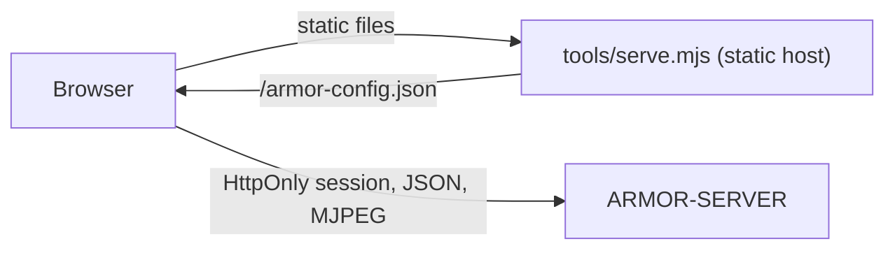

<p align="center">
  
</p>

# 🎛️ ARMOR-STUDIO

<p align="center">
  <a href="README.md">🇺🇸 English</a> |
  🇪🇸 <b>Español</b> |
  <a href="README_fra.md">🇫🇷 Français</a> |
  <a href="README_ita.md">🇮🇹 Italiano</a> |
  <a href="README_deu.md">🇩🇪 Deutsch</a> |
  <a href="README_zho.md">🇨🇳 简体中文</a> |
  <a href="README_jpn.md">🇯🇵 日本語</a>
</p>

### Consola de operaciones y diseño: cámaras, radar, alarmas, energía solar, evidencias y plano del sitio

<p align="center">
  
  
  
  
  
  
</p>

---

**Comprobación de honestidad - qué funciona hoy:** Studio habla con [ARMOR-SERVER](https://github.com/JuanenRac/ARMOR-SERVER) y está cubierto por 203 pruebas unitarias (lectura de ajustes, fusión de cámaras, la aritmética de las gráficas solares, cada menú dibujado en los siete idiomas, el servidor estático). **No** está probado el vídeo en vivo y el PTZ con cada cámara real, los menús solares con un inversor o batería reales ni una revisión formal de accesibilidad o usabilidad. Mientras no se alcanza el servidor, Studio muestra datos de demostración y lo dice en la barra superior.

---

## 🎯 Descripción general

**ARMOR-STUDIO** es la consola del operador. Nunca guarda una contraseña de cámara, una dirección RTSP ni un token: inicia sesión en el servidor con usuario y contraseña, recibe una sesión **HttpOnly** de 8 horas y todo lo privilegiado viaja por esa sesión.

* **Monitor de cámaras:** 1, 2, 4, 6, 8, 9, 12 o 16 teselas que se ajustan a su marco (16:9, toda la matriz visible, sin recortes), una vista maximizada con mando PTZ acotado, captura y grabación MP4; una **biblioteca de grabaciones** para filtrar, previsualizar, reproducir, proteger y borrar evidencias.
* **Alarmas, dispositivos y automatizaciones:** lo que necesita a una persona ahora mismo con reconocer y el registro cerrado; dispositivos de humo, gas, inundación, puerta, ventana, movimiento, clima, enchufe, luz, sirena y cerradura por Wi-Fi, Zigbee, Bluetooth o cable (preajustes para Zigbee2MQTT, Tasmota y Shelly); reglas que accionan dispositivos ante un suceso; un botón grande de armar / desarmar.
* **Energía solar:** el menú *Inversores* dibuja la casa como un flujo de energía animado (paneles, red, inversor, batería y consumo, con guiones que corren más rápido cuanta más potencia), medidores, lecturas, avisos en palabras y gráficas de historial; el menú *Baterías* muestra cada pila con un nivel de líquido, sus **capacidades** (restante y total, Ah y kWh, ciclos, modelo), cada módulo y **cada celda** como una barra con su tensión y la diferencia en milivoltios, y gráficas de carga, tensión, corriente, rango de celdas y temperatura.
* **Resumen y sistema:** el estado del perímetro, una tesela por parte, un mapa vivo del diseño con cada dispositivo y una página de sistema con el registro de auditoría para un administrador.
* **Radar:** un mapa en vivo dibujado desde tu diseño del sitio (terreno, edificios, cámaras, radares y su cobertura) con los objetivos que informa cada radar, su recorrido reciente y las zonas ignoradas; estado de los nodos en vivo, con los nodos silenciosos como *obsoletos*; el panel propio de cada nodo queda a un clic.
* **Diseñador del sitio:** dibuja el terreno (rectángulo o cualquier forma, con longitudes tecleadas), coloca edificios de varias plantas con cinco tipos de tejado, puertas y ventanas a cualquier planta y altura, farolas, chimeneas, paneles solares, antenas, pilares, mástiles, carreteras y caminos, y luego cámaras y radares donde quieras; un plano 2D estilo CAD y una vista 3D que puedes orbitar, cortar planta a planta y editar; deshacer y rehacer.
* **Configuración:** dirección del servidor, cámaras (ONVIF/RTSP), descubrimiento, usuarios (tu cuenta y, para un administrador, la lista de usuarios, roles y contraseñas), tema e idioma; una exportación portátil del sitio **sin credenciales**.
* **Siete idiomas** (inglés, español, alemán, francés, italiano, japonés y chino) y once temas, el predeterminado llamado *Armor*.
* **Declara tu equipo:** en los menús Inversores y Baterías añades cada inversor o pila de baterías con su nombre, modelo (Voltronic, MPP Solar, Pylontech US2000 / US3000 / US5000, ANT-BMS), conexión (RS232, RS485, USB, CAN, Wi-Fi) y nodo pasarela; espera su primera lectura real y *Ver lecturas de ejemplo* te deja probar el menú mientras tanto.
* **Diseñador eléctrico:** dibuja el esquema eléctrico de la casa (red, contador, protecciones, conmutadores, distribución, FV, inversores, baterías y cargas, en AC y DC) con puertos y cables, agrúpalo en cuadros, une inversores y baterías con los dispositivos solares que lee el servidor para ver sus valores en directo, y deja que las comprobaciones lo revisen (dos fuentes en una línea, magnetotérmicos y cables frente a la corriente, protecciones que faltan, tensiones DC). El dibujo se guarda en el servidor; es un dibujo: de momento nada maniobra ni mide.

## 🔄 Arquitectura



## 🔒 Modelo de seguridad

* **Ningún secreto en el navegador.** Las contraseñas de las cámaras se teclean una vez, se envían al servidor y después solo se ven como un estado "guardada" enmascarado. Las exportaciones del sitio omiten usuarios e indicadores de credenciales.
* **Los ajustes guardados son entrada no fiable.** Se leen valor a valor: un origen, tema, idioma o forma no válidos se descartan, las posiciones se acotan y las listas se limitan.
* **Ninguna petición a terceros.** Las fuentes son locales; el servidor estático envía `Content-Security-Policy: default-src 'self'` limitada al servidor configurado, `frame-ancestors 'none'`, `nosniff` y `no-referrer`.
* El vídeo en vivo solo se muestra mediante una dirección de emisión que el servidor entrega a un operador.

## 📂 Estructura del repositorio

```text
ARMOR-STUDIO/
├── src/
│   ├── App.tsx, domain.ts, settings.ts, cameras.ts, hooks.ts, api.ts, config.ts, i18n.ts
│   ├── components/   camera, chrome, SiteMap
│   ├── views/        overview, monitoring, RadarView, RadarSensors, AlarmsView, DevicesView, AutomationsView, InvertersView, BatteriesView, SystemView
│   ├── designer/     geometry, ops, model, Plan2D, Viewport3D, Toolbox, Inspector
│   ├── electrical/   the Electrical Designer: model, ops, analysis (the checks), presets, symbols, sync
│   ├── solarModel.ts, solarGraphics.tsx, solarText.ts   the arithmetic, the drawings and the words of the solar menus
│   └── ...           ConfigurationPanel, UsersPanel, MediaLibrary, HistoryView, SiteDesignerInteractive, StudioLogin, one *Text.ts per area (7 languages)
├── tools/            serve.mjs (+ tests)
├── docs/             security model
└── images/           brand assets
```

## 🛠️ Entorno de desarrollo

```powershell
npm install
npm run dev         # http://127.0.0.1:5178 against a server on 127.0.0.1:8080
npm run typecheck
npm test            # 203 tests: designer geometry, settings, cameras, radar map, solar arithmetic, the electrical designer, every menu in seven languages, static host
npm run build       # dist/
$env:ARMOR_SERVER_ORIGIN="http://192.168.0.180:18080"; node tools/serve.mjs   # serve the build
```

`tools/serve.mjs` lee `ARMOR_STUDIO_HOST` (por defecto `127.0.0.1`), `ARMOR_STUDIO_PORT` (`5178`), `ARMOR_STUDIO_DIST` y `ARMOR_SERVER_ORIGIN`. Para instalar toda la pila en el banco de pruebas de la CM5 véase [ARMOR-DEVOPS](https://github.com/JuanenRac/ARMOR-DEVOPS).

## 🔗 Proyectos relacionados

**A.R.M.O.R.** (Autonomous Radar & Multimodal Observation Range) es un sistema de seguridad perimetral hecho de repositorios independientes. Cada uno tiene su propia versión, sus propias pruebas y su propio README; esta es la familia:

* **[ARMOR-COMMON](https://github.com/JuanenRac/ARMOR-COMMON)** - Contratos de mensajes, validadores, vectores de conformidad y tipos generados
* **[ARMOR-RADAR](https://github.com/JuanenRac/ARMOR-RADAR)** - Firmware del nodo de campo para ESP32-S3 con tres radares y su propio panel web
* **[ARMOR-SOLAR](https://github.com/JuanenRac/ARMOR-SOLAR)** - Protocolos de inversores y baterías solares y los mensajes de un nodo pasarela
* **[ARMOR-ELECTRICAL](https://github.com/JuanenRac/ARMOR-ELECTRICAL)** - Nodo eléctrico: contadores, el mensaje de las lecturas de la red y las reglas para maniobrar
* **[ARMOR-HMI](https://github.com/JuanenRac/ARMOR-HMI)** - Panel táctil: el estado del sistema en una pantalla de pared, armar y reconocer alarmas, y el hogar del asistente de voz
* **[ARMOR-NETWORK](https://github.com/JuanenRac/ARMOR-NETWORK)** - La red local: sus dispositivos, internet y lo que cambia
* **[ARMOR-SERVER](https://github.com/JuanenRac/ARMOR-SERVER)** - Coordinador central: telemetría, alarmas, dispositivos, lecturas solares y cámaras
* **ARMOR-STUDIO** (este repositorio) - Consola web: cámaras, radar, alarmas, energía solar y el diseñador de sitio 2D/3D
* **[ARMOR-ANDROID-CONTROL](https://github.com/JuanenRac/ARMOR-ANDROID-CONTROL)** - Cliente Android del operador con radar 2D/3D en vivo
* **[ARMOR-SERVER-AI](https://github.com/JuanenRac/ARMOR-SERVER-AI)** - Política de inferencia visual que explica sus decisiones y nunca actúa
* **[ARMOR-VOICE-AI](https://github.com/JuanenRac/ARMOR-VOICE-AI)** - Intenciones de voz sin conexión con una confirmación imposible de falsificar
* **[ARMOR-HARDWARE](https://github.com/JuanenRac/ARMOR-HARDWARE)** - Cajas, electrónica y la matriz de aceptación en banco
* **[ARMOR-DEVOPS](https://github.com/JuanenRac/ARMOR-DEVOPS)** - Despliegue, el banco de pruebas de la CM5, copias de seguridad y TLS
* **[ARMOR-SIMULATOR](https://github.com/JuanenRac/ARMOR-SIMULATOR)** - Simulador de telemetría sin conexión con fallos repetibles
* **[ARMOR-UPDATER](https://github.com/JuanenRac/ARMOR-UPDATER)** - Detecta, instala y actualiza los propios repositorios del ecosistema
* **[ARMOR-DOCS](https://github.com/JuanenRac/ARMOR-DOCS)** - Arquitectura, base de seguridad y la matriz de capacidades

## 📚 Documentación y comunidad

Dónde leer más:

* [Matriz de capacidades: qué está probado y qué no](https://github.com/JuanenRac/ARMOR-DOCS/blob/main/docs/CAPABILITY_MATRIX.md)
* [Catálogo de proyectos: versiones y cómo dependen unos de otros](https://github.com/JuanenRac/ARMOR-DOCS/blob/main/docs/PROJECT_CATALOG.md)
* [Historial de cambios de este repositorio](CHANGELOG.md)
* [Licencia (GPL-3.0-or-later)](LICENSE)
* Preguntas, ideas e informes: electrohobby3d@gmail.com

## 👤 AUTOR

**JuanenRac (Electro Hobby 3D)** · electrohobby3d@gmail.com

## 📜 LICENCIA

GPL-3.0-or-later - véase [LICENSE](LICENSE).
