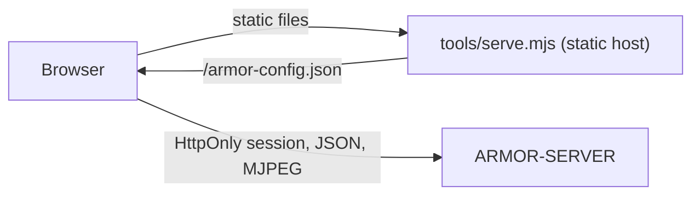

<p align="center">
  
</p>

# 🎛️ ARMOR-STUDIO

<p align="center">
  <a href="README.md">🇺🇸 English</a> |
  <a href="README_spa.md">🇪🇸 Español</a> |
  <a href="README_fra.md">🇫🇷 Français</a> |
  <a href="README_ita.md">🇮🇹 Italiano</a> |
  <a href="README_deu.md">🇩🇪 Deutsch</a> |
  🇨🇳 <b>简体中文</b> |
  <a href="README_jpn.md">🇯🇵 日本語</a>
</p>

### 运营与设计控制台：摄像头、雷达、报警、太阳能、证据和场地平面图

<p align="center">
  
  
  
  
  
  
</p>

---

**诚实性检查 - 今天真正能运行的部分:** Studio 与 [ARMOR-SERVER](../ARMOR-SERVER) 通信，并有 203 个单元测试覆盖（设置解析、摄像头合并、太阳能图表的算术、每个菜单在七种语言下的渲染、静态主机）。**尚未证实的：** 每种真实摄像头的实时视频和 PTZ、太阳能菜单与真实逆变器或电池的配合，以及正式的无障碍或可用性评审。当服务器无法访问时，Studio 显示演示数据，并在顶部栏中说明。

---

## 🎯 概述

**ARMOR-STUDIO** 是操作员的控制台。它从不持有摄像头密码、RTSP 地址或令牌：它用用户名和密码登录服务器，获得 8 小时的 **HttpOnly** 会话，一切特权操作都经由该会话。

* **摄像头监控：** 1、2、4、6、8、9、12 或 16 个画面块，适应其画框（16:9，整个矩阵可见，不裁切），带受限 PTZ 控制盘的最大化视图、快照和 MP4 录像；**录像库**可过滤、预览、播放、保护和删除证据。
* **报警、设备与自动化：** 现在需要人处理的事项，可确认，并有已关闭的记录；通过 Wi-Fi、Zigbee、蓝牙或有线接入的烟雾、燃气、水浸、门、窗、移动、气候、插座、灯、警笛和门锁设备（带 Zigbee2MQTT、Tasmota 和 Shelly 预设）；在事件发生时切换设备的规则；一个大的布防 / 撤防按钮。
* **太阳能：** *逆变器*菜单把房屋画成动画能量流（光伏板、电网、逆变器、电池和负载，功率越大虚线跑得越快）、仪表、读数、用文字表述的警告和历史图表；*电池*菜单显示每个电池组及其液位、**容量**（剩余和满容量，Ah 和 kWh，循环次数，型号）、每个模块以及**每个电芯**（以柱状条显示电压和以毫伏计的压差），还有电量、电压、电流、电芯范围和温度的图表。
* **概览与系统：** 周界状态、每个部分一块磁贴、带所有设备的设计实时地图，以及为管理员提供审计记录的系统页面。
* **雷达：** 由你的场地设计绘制的实时地图（地形、建筑、摄像头、雷达及其覆盖范围），显示每个雷达报告的目标、其近期路径和忽略区域；实时节点状态，静默节点显示为*过期*；每个节点自己的面板一键即达。
* **场地设计器：** 绘制地形（矩形或任意形状，可键入长度），放置多层建筑及五种屋顶，任意楼层和高度的门窗，灯、烟囱、太阳能板、天线、立柱、桅杆、道路和小径，然后把摄像头和雷达放在任何位置；CAD 风格的 2D 平面图和可环绕、逐层剖切并编辑的 3D 视图；撤销和重做。
* **配置：** 服务器地址、摄像头（ONVIF/RTSP）、发现、用户（你的账户，管理员还可看到用户、角色和密码列表）、主题和语言；**不含凭据**的便携式场地导出。
* **七种语言**（英语、西班牙语、德语、法语、意大利语、日语、中文）和十一种主题，默认主题名为 *Armor*。
* **登记你的设备：** 在“逆变器”和“电池”菜单中，为每台逆变器或电池组添加名称、型号（Voltronic、MPP Solar、Pylontech US2000 / US3000 / US5000、ANT-BMS）、连接方式（RS232、RS485、USB、CAN、Wi-Fi）和网关节点；它会等待第一次真实读数，期间可用“显示示例读数”试用菜单。
* **电气设计器：** 绘制住宅的电气图（电网、电表、保护装置、转换开关、配电、光伏、逆变器、电池和负载，交流与直流），用端口和导线连接，按配电箱分组，把逆变器和电池与服务器读取的光伏设备关联以查看实时数值，并让检查功能审阅（一条线路上有两个电源、断路器和导线与电流的匹配、缺失的保护、直流电压）。图纸保存在服务器上；这只是一张图：目前不会控制或测量任何设备。

## 🔄 架构



## 🔒 安全模型

* **浏览器中没有机密。** 摄像头密码只输入一次，发送到服务器，之后只显示为被遮蔽的“已保存”状态。场地导出会去掉用户名和凭据标志。
* **保存的设置属于不可信输入。** 它们被逐值解析：无效的源、主题、语言或形状会被丢弃，位置被限制范围，列表被限制大小。
* **没有第三方请求。** 字体来自本地；静态主机发送限于所配置服务器的 `Content-Security-Policy: default-src 'self'`、`frame-ancestors 'none'`、`nosniff` 和 `no-referrer`。
* 实时视频只通过服务器发给操作员的视频流地址显示。

## 📂 仓库结构

```text
ARMOR-STUDIO/
├── src/
│   ├── App.tsx, domain.ts, settings.ts, cameras.ts, hooks.ts, api.ts, config.ts, i18n.ts
│   ├── components/   camera, chrome, SiteMap
│   ├── views/        overview, monitoring, RadarView, RadarSensors, AlarmsView, DevicesView, AutomationsView, InvertersView, BatteriesView, SystemView
│   ├── designer/     geometry, ops, model, Plan2D, Viewport3D, Toolbox, Inspector
│   ├── electrical/   the Electrical Designer: model, ops, analysis (the checks), presets, symbols, sync
│   ├── solarModel.ts, solarGraphics.tsx, solarText.ts   the arithmetic, the drawings and the words of the solar menus
│   └── ...           ConfigurationPanel, UsersPanel, MediaLibrary, HistoryView, SiteDesignerInteractive, StudioLogin, one *Text.ts per area (7 languages)
├── tools/            serve.mjs (+ tests)
├── docs/             security model
└── images/           brand assets
```

## 🛠️ 开发环境

```powershell
npm install
npm run dev         # http://127.0.0.1:5178 against a server on 127.0.0.1:8080
npm run typecheck
npm test            # 203 tests: designer geometry, settings, cameras, radar map, solar arithmetic, the electrical designer, every menu in seven languages, static host
npm run build       # dist/
$env:ARMOR_SERVER_ORIGIN="http://192.168.0.180:18080"; node tools/serve.mjs   # serve the build
```

`tools/serve.mjs` 读取 `ARMOR_STUDIO_HOST`（默认 `127.0.0.1`）、`ARMOR_STUDIO_PORT`（`5178`）、`ARMOR_STUDIO_DIST` 和 `ARMOR_SERVER_ORIGIN`。要把整套系统安装到 CM5 测试台，参见 [ARMOR-DEVOPS](../ARMOR-DEVOPS)。

## 🔗 相关项目

**A.R.M.O.R.**（Autonomous Radar & Multimodal Observation Range）是由若干独立仓库组成的周界安防系统。每个仓库都有自己的版本、测试和 README；家族成员如下：

* **[ARMOR-COMMON](../ARMOR-COMMON)** - 消息契约、验证器、一致性向量和生成的类型
* **[ARMOR-RADAR](../ARMOR-RADAR)** - 适用于 ESP32-S3 的现场节点固件，带三个雷达和自带网页面板
* **[ARMOR-SOLAR](../ARMOR-SOLAR)** - 太阳能逆变器与电池的协议，以及网关节点的消息
* **[ARMOR-ELECTRICAL](../ARMOR-ELECTRICAL)** - 电气节点：电表、电网读数消息和开关规则
* **[ARMOR-NETWORK](../ARMOR-NETWORK)** - 本地网络：其设备、互联网以及变化
* **[ARMOR-SERVER](../ARMOR-SERVER)** - 中央协调器：遥测、报警、设备、太阳能读数和摄像头
* **ARMOR-STUDIO** (本仓库) - 网页控制台：摄像头、雷达、报警、太阳能和 2D/3D 场地设计器
* **[ARMOR-ANDROID-CONTROL](../ARMOR-ANDROID-CONTROL)** - 带实时 2D/3D 雷达的 Android 操作员客户端
* **[ARMOR-SERVER-AI](../ARMOR-SERVER-AI)** - 会解释决策且从不执行动作的视觉推理策略
* **[ARMOR-VOICE-AI](../ARMOR-VOICE-AI)** - 带无法伪造确认的离线语音意图
* **[ARMOR-HARDWARE](../ARMOR-HARDWARE)** - 外壳、电子器件和台架验收矩阵
* **[ARMOR-DEVOPS](../ARMOR-DEVOPS)** - 部署、CM5 测试台、备份与 TLS
* **[ARMOR-SIMULATOR](../ARMOR-SIMULATOR)** - 带可重复故障的离线遥测模拟器
* **[ARMOR-UPDATER](../ARMOR-UPDATER)** - 发现、安装并更新生态系统自身的仓库
* **[ARMOR-DOCS](../ARMOR-DOCS)** - 架构、安全基线和能力矩阵

## 📚 文档与社区

更多阅读：

* [能力矩阵：哪些已被证实，哪些没有](../ARMOR-DOCS/docs/CAPABILITY_MATRIX.md)
* [项目目录：版本以及各仓库之间的依赖](../ARMOR-DOCS/docs/PROJECT_CATALOG.md)
* [本仓库的变更记录](CHANGELOG.md)
* [许可证（GPL-3.0-or-later）](LICENSE)
* 问题、想法与反馈：electrohobby3d@gmail.com

## 👤 作者

**JuanenRac (Electro Hobby 3D)** · electrohobby3d@gmail.com

## 📜 许可证

GPL-3.0-or-later - 见 [LICENSE](LICENSE)。
